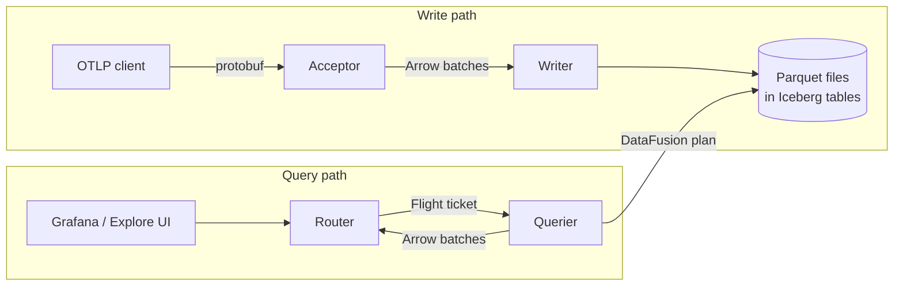

# The FDAP stack

SignalDB is built on the FDAP stack: Apache Arrow **F**light,
**D**ataFusion, **A**rrow, and **P**arquet. The term was coined by
InfluxData, which built InfluxDB 3.0 the same way — their
[glossary entry](https://www.influxdata.com/glossary/fdap-stack/) and
[architecture write-up](https://www.influxdata.com/blog/flight-datafusion-arrow-parquet-fdap-architecture-influxdb/)
are good outside reading. The idea: instead of writing a storage engine,
a wire protocol, and a query engine from scratch, compose a database from
four Apache projects that share one columnar data model, so data crosses
the whole pipeline without format conversions.

This page explains what each layer does in SignalDB and where SignalDB
deviates from the canonical FDAP design.

## Why it fits an observability database

Telemetry is written once, in bulk, and queried by column: "p99 of
`duration_nanos` grouped by `service.name` over an hour" touches two
columns of millions of rows. Columnar formats make that cheap, and using
_one_ columnar format everywhere means ingestion, transport, query
execution, and storage never pay a serialization boundary. The expensive
parts SignalDB did not have to build — a vectorized SQL engine, a
compressed on-disk format, a streaming RPC layer — are shared
infrastructure maintained by the Arrow community.

## The four layers

### Arrow — the in-memory format

[Apache Arrow](https://arrow.apache.org/overview/) defines a
language-independent columnar memory layout. In SignalDB it is the type
system for everything in flight: the acceptor converts incoming OTLP
protobuf into Arrow `RecordBatch`es once, and from there batches move
through WAL, inter-service transfer, query execution, and result
streaming without being re-encoded. The batch schemas are defined in
`src/common/flight/schema.rs` (see [Flight schemas](flight-communication.md)).

### Flight — the wire protocol

[Arrow Flight](https://arrow.apache.org/docs/format/Flight.html) is a
[gRPC](https://grpc.io/)-based protocol for streaming Arrow record
batches between processes. SignalDB uses it for all inter-service data
transfer: the acceptor hands batches to the writer with `do_put`, and
the router fetches query results from queriers with `do_get`, where the
Flight _ticket_ encodes the query and tenant context. Because the wire
format is Arrow's own memory layout, sending a batch does not require
transcoding it.

### DataFusion — the query engine

[Apache DataFusion](https://datafusion.apache.org/) is an embeddable,
vectorized query engine written in Rust with Arrow as its memory model
(its design is described in the
[SIGMOD 2024 paper](https://doi.org/10.1145/3626246.3653368)). The
querier plans and executes every query with it. Notably, SignalDB's
query APIs — TraceQL, LogQL, PromQL, and SQL — do not template SQL
strings: each parsed query is lowered to DataFusion `Expr`s and logical
plans directly, and DataFusion handles predicate pushdown, partition
pruning, and vectorized execution against the Parquet files.

### Parquet — the storage format

[Apache Parquet](https://parquet.apache.org/) is the compressed,
columnar at-rest format. Every signal ends up as Parquet files in an
object store (local filesystem, S3/MinIO). Columnar compression is what
makes retention cheap, and Parquet's footer statistics let DataFusion
skip files and row groups that cannot match a query's time range or
predicates.

## Where SignalDB deviates

**Iceberg as the table format.** Canonical FDAP stops at "Parquet files
plus a custom catalog". SignalDB instead manages its Parquet files as
[Apache Iceberg](https://iceberg.apache.org/) tables: an open table
format contributing ACID commits, snapshots, schema evolution, and
hour-partitioned metadata. That is what the compactor builds on —
rewriting small files, expiring snapshots, and dropping expired
partitions are Iceberg metadata operations, not filesystem surgery.
Partition-level metadata is also what keeps compaction affordable: a
compaction job scopes itself to one closed hour partition and commits a
delta against it, so its cost tracks that partition rather than the whole
table, and concurrent ingest into other partitions cannot invalidate the
commit.

**A WAL in front of the columnar path.** Arrow batches are buffered
poorly by object stores, so ingestion writes to a local write-ahead log
before acknowledging the client; the writer drains the WAL into Parquet
asynchronously. WAL records are length-framed and CRC-32 checked (the
`crc32fast` dependency), so a damaged record is attributed and skipped
instead of poisoning its segment. See
[WAL persistence](../operations/wal-persistence.md).

**Semantics ride outside the stack.** The FDAP layers carry bytes and
types, not meaning. What an attribute key or metric name _means_ comes from
the OpenTelemetry semantic conventions, which SignalDB vendors
(`vendor/otel-semconv/`) and parses with the dependency-light `schema-model`
crate — deliberately free of Arrow/DataFusion so the schema registry can be
built and validated without the query engine.

The compatibility **query languages** sit outside the stack for the same
reason: `logql` and `traceql` carry no Arrow, no DataFusion, and no SignalDB
dependency, so a query can be parsed and validated without the query engine.
Lowering a parsed query onto columns stays in the querier. See
[Compatibility crates](../contributing/compat-crates.md).

SignalDB's own **query IR** (`src/query-ir`) sits outside the stack for the
same reason, though it re-implements nobody: an IR document can be built,
versioned, and validated with `serde` alone, so a client can construct and
check a query without the engine that will run it. Field resolution enters
through a trait the querier implements, which is what keeps attribute
promotion invisible to the IR.

`ql-ir` joins the two: it lowers a parsed LogQL or TraceQL query into an IR
document, and because all three of its dependencies are themselves FDAP-free,
so is it. That is what makes client-side query *construction* possible rather
than only client-side syntax checking — turning query text into something
executable has never needed the engine that executes it. Only TraceQL is
lowered today; see design D6 in the archived `publishable-ql-crates` change.

**One version rule.** Arrow, Parquet, and DataFusion evolve together and
must agree on versions. SignalDB therefore always imports Arrow and
Parquet types through DataFusion's re-exports — the rule and rationale
live in the [Rust standards](../contributing/rust.md#fdap-version-alignment).

## Further reading

- [FDAP stack glossary — InfluxData](https://www.influxdata.com/glossary/fdap-stack/)
- [Using the FDAP architecture to build InfluxDB 3.0 — InfluxData](https://www.influxdata.com/blog/flight-datafusion-arrow-parquet-fdap-architecture-influxdb/)
- [Apache Arrow overview](https://arrow.apache.org/overview/)
- [Arrow Flight protocol](https://arrow.apache.org/docs/format/Flight.html)
- [Apache DataFusion](https://datafusion.apache.org/) and the
  [SIGMOD 2024 paper](https://doi.org/10.1145/3626246.3653368)
- [Apache Parquet](https://parquet.apache.org/)
- [Apache Iceberg](https://iceberg.apache.org/)
- [SignalDB architecture overview](overview.md)
