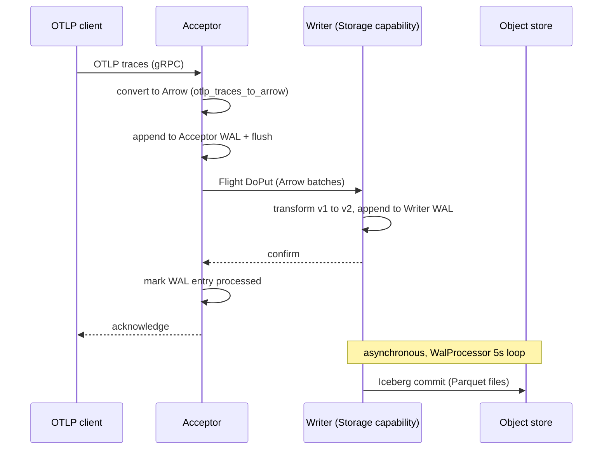
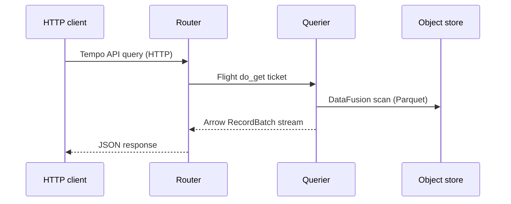

# SignalDB Flight Communication Design

## 1. Introduction

This document outlines the design for Apache Arrow Flight as the primary communication mechanism in SignalDB, both for inter-service communication and external client access. The design leverages the performance benefits of Arrow Flight while maintaining compatibility with the current architecture.

**Current Implementation Status**: ✅ **Complete** - Full Flight communication with WAL integration is implemented and production-ready. All integration tests passing.

## 2. Background

### 2.1 Current Architecture

SignalDB currently uses:
- **Apache Arrow Flight** as the primary inter-service communication mechanism ✅ **Implemented**
- OTLP data received via gRPC and HTTP at the Acceptor
- Direct Flight communication between Acceptor and Writer
- Direct Flight communication between Router and Querier
- Object storage integration for Parquet persistence

**Current architecture with WAL integration:**

```
External Clients
      │
      ▼ (OTLP/gRPC)
┌─────────────┐    ┌──────┐  Flight  ┌─────────────┐    ┌─────────────┐
│   Acceptor  │───▶│ WAL  │────────▶│    Writer   │───▶│   Storage   │
└─────────────┘    └──────┘          └─────────────┘    └─────────────┘
     (OTLP)        (Disk)     (Flight)       (Parquet)
                                                  │
                                                  ▼
┌─────────────┐    HTTP   ┌─────────────┐  Flight  ┌─────────────┐
│   Clients   │◀─────────│    Router   │───────▶│   Querier   │
└─────────────┘   (Tempo)  └─────────────┘ (DataFusion) └─────────────┘
```

**What's Working (✅ Complete):**
1. OTLP clients send telemetry data to the Acceptor
2. Acceptor writes data to WAL for durability, then converts OTLP to Arrow format
3. Acceptor forwards data to Writer via Flight (with Storage capability routing)
4. Writer receives Arrow data and persists to Parquet storage
5. Writer marks WAL entries as processed after successful storage
6. Router exposes HTTP endpoints (Tempo API) and forwards queries via Flight
7. Querier executes DataFusion queries against Parquet storage
8. All services discover each other via catalog-based service registry

### 2.2 Apache Arrow Flight

Apache Arrow Flight is a high-performance client-server framework designed for efficient transfer of large datasets over network interfaces.

Key benefits include:
- Native Arrow format transfer (no serialization/deserialization overhead)
- High throughput, low latency data transfer
- Streaming capabilities
- Built on gRPC with authentication and encryption support

## 3. Design Goals

1. ✅ **Achieved**: Improve performance of data transfer between components
2. ✅ **Achieved**: Provide a high-performance query interface for external clients
3. ✅ **Achieved**: Maintain logical separation of components while supporting monolithic deployment
4. ✅ **Achieved**: Eliminate the need for a separate message bus
5. ✅ **Achieved**: Support both in-process and networked communication with the same code
6. ✅ **Achieved**: Implement WAL-based durability with automatic recovery
7. ✅ **Achieved**: Provide capability-based service discovery and routing

## 4. Flight Integration Design

### 4.1 Current Implementation

The current architecture uses Flight as the primary data transfer mechanism:

```
External Clients
      │
      ▼
┌─────────────┐    ┌─────────────┐    ┌─────────────┐
│   Acceptor  │───▶│    Writer   │───▶│   Storage   │
└─────────────┘    └─────────────┘    └─────────────┘
                                            │
                                            ▼
                                      ┌─────────────┐
│   Clients   │◀─────────────────────│   Router    │───▶│   Querier   │
└─────────────┘                      └─────────────┘    └─────────────┘
```

All data-intensive communication between components uses Flight.

### 4.2 Component Flight Services ✅ **Implemented**

Each component implements a Flight service:

- **Acceptor**: no Flight server; acts as a Flight client forwarding data to the Writer
- **IcebergWriterFlightService**: Receives data from Acceptor and writes to Iceberg tables
- **QuerierFlightService**: Executes queries against storage and returns results
- **SignalDBFlightService** (Router): Exposes HTTP API and forwards requests to Querier via Flight
- **CompactorFlightService**: Admin-only `DoAction` interface for compaction management

### 4.3 External Flight Interface

The Router exposes Flight capabilities via HTTP endpoints, providing:
- Query execution via Tempo-compatible API
- Trace retrieval and search functionality
- Administrative operations

### 4.4 Supported Flight RPC Methods

The following table shows the Flight RPC methods supported by each service:

| Method | Router | Querier | Writer | Compactor | Description |
|--------|--------|---------|--------|-----------|-------------|
| `Handshake` | ✅ | ✅ | ✅ | ❌ | Protocol version exchange |
| `ListFlights` | ✅ | ✅ | Empty stream | ❌ | List available query types |
| `GetFlightInfo` | ✅ | ❌ | ❌ | ❌ | Get metadata for a query |
| `GetSchema` | ✅ | ✅ | ❌ | ❌ | Get schema for a query type |
| `DoGet` | ✅ | ✅ | ❌ | ❌ | Execute query and stream results |
| `DoPut` | ❌ | ❌ | ✅ | ❌ | Write data to storage |
| `DoExchange` | ❌ | ❌ | ❌ | ❌ | Not implemented |
| `DoAction` | ❌ | ❌ | ❌ | ✅ | Admin commands (compactor only) |
| `ListActions` | Empty stream | Empty stream | Empty stream | ✅ | List admin commands |

Legend: ✅ implemented, ❌ returns `unimplemented`, "Empty stream" succeeds but yields nothing (a no-op, not an error).

**Note**: The Router is the primary client-facing Flight interface. Clients typically connect to the Router for all query operations. The Compactor's Flight service (`src/compactor/src/flight.rs`) is an admin interface only: `do_action` supports `compact_now`, `compact_status`, and `compact_dry_run`; every other RPC returns `unimplemented`.

#### Ticket and Command Grammar

There are two layers with different grammars -- the Router's descriptor commands and the Querier's `do_get` tickets:

**Router** (`src/router/src/endpoints/flight.rs`) -- `get_flight_info`, `get_schema`, and `list_flights` recognize these `FlightDescriptor` `cmd` values:

| Command | Description | Notes |
|---------|-------------|-------|
| `traces` | Trace/span schema and metadata | `do_get` currently returns an **empty stream** (placeholder) |
| `trace_by_id?id={id}` | Single-trace schema and metadata | `do_get` currently returns an **empty stream** (placeholder) |
| `logs` | Log schema and metadata | `do_get` currently returns an **empty stream** (placeholder) |
| `metrics` | Metric schema and metadata | `do_get` currently returns an **empty stream** (placeholder) |

Any other `do_get` ticket (including `find_trace:...`, `search_traces:...`, and raw SQL) is proxied verbatim to a Querier discovered via the `QueryExecution` capability, with request metadata forwarded.

**Querier** (`parse_ticket` in `src/querier/src/flight.rs`) -- `do_get` tickets use this grammar:

| Ticket | Description |
|--------|-------------|
| `find_trace:{tenant_slug}:{dataset_slug}:{trace_id}[:{start}:{end}]` | Single trace lookup; the optional trailing segments are unix-second time hints (either may be empty) that prune the scanned range. Routers only append them when a hint is present, so the 3-part form remains valid. A missing trace yields a Flight `not_found` status, not an empty stream |
| `search_traces:{tenant_slug}:{dataset_slug}:{params_json}` | Trace search (`SearchQueryParams` as JSON; unknown fields are ignored on deserialization) |
| `query_logs:{tenant_slug}:{dataset_slug}:{params_json}` | LogQL log query (`LogQueryParams` as JSON: LogQL string, nanosecond start/end, limit, direction). Returns the projected log columns ordered by timestamp |
| `query_logs_labels:{tenant_slug}:{dataset_slug}:{start}:{end}` | Log label names in the nanosecond window |
| `query_logs_label_values:{tenant_slug}:{dataset_slug}:{label}:{start}:{end}` | Distinct values of one log label in the window |
| `query_logs_series:{tenant_slug}:{dataset_slug}:{params_json}` | Series (label sets) matching a stream selector (`LogSeriesParams` as JSON) |
| anything else | Treated as a raw SQL query executed via DataFusion |

The standalone querier binary additionally serves Tempo's `tempopb.Querier`
gRPC protocol on the same port as Flight (see the
[Tempo API reference](../users/tempo-api-reference.md#tempo-grpc-querier-protocol));
that protocol does not use tickets.

There is no `trace_by_id?id=...` ticket form at the Querier; that command exists only in the Router's metadata path. The Tempo HTTP endpoints bypass the Router's Flight commands entirely and send `find_trace:`/`search_traces:`/SQL tickets straight to the Querier.

## 5. Implementation Details

### 5.1 Current Data Flow ✅ **Working**

#### Trace Ingestion Flow:



1. Acceptor receives OTLP trace data via gRPC
2. Acceptor converts OTLP to Arrow format using `otlp_traces_to_arrow`
3. Acceptor appends the batch to its WAL and flushes for durability
4. Acceptor uses Flight `DoPut` to send Arrow data to Writer (Storage capability)
5. Writer transforms to the v2 storage schema and appends to its own WAL
6. Writer confirms; Acceptor marks its WAL entry as processed
7. Writer's `WalProcessor` asynchronously commits WAL entries to Iceberg (Parquet in the object store)

#### Query Flow:



1. Client sends HTTP query to Router
2. Router forwards query to Querier via Flight
3. Querier executes query using DataFusion against Parquet files
4. Results streamed back to client via Flight → HTTP

### 5.2 Schema Design ✅ **Implemented**

Flight schemas are defined in `src/common/src/flight/schema.rs` with conversions for:
- OTLP traces → Arrow schema
- OTLP metrics → Arrow schema
- OTLP logs → Arrow schema

### 5.3 Service Discovery Integration ✅ **Implemented**

Components discover each other via:
- **Catalog-based service registry** with PostgreSQL/SQLite backend
- **ServiceBootstrap pattern** for automatic registration on startup
- **Capability-based routing** (TraceIngestion, Storage, QueryExecution, Routing)
- **Heartbeat monitoring** with automatic TTL-based cleanup
- **Flight endpoint discovery** with connection pooling

## 6. WAL Integration ✅ **Implemented**

Write-Ahead Log provides durability and crash recovery capabilities:

```
┌─────────────┐    ┌─────────────┐    ┌─────────────┐
│   Acceptor  │───▶│     WAL     │───▶│    Writer   │
└─────────────┘    └─────────────┘    └─────────────┘
```

#### Implemented WAL Features:
1. ✅ **Durability**: Write incoming data to WAL before acknowledgment
2. ✅ **Recovery**: Automatic replay of unprocessed entries on restart
3. ✅ **Batching**: Efficient batch processing with configurable flush policies
4. ✅ **Entry Tracking**: WAL entries marked as processed after successful storage
5. ✅ **Configurable Storage**: Persistent WAL directories with segment rotation

#### Future WAL Enhancements:
1. **Compression**: WAL segment compression for storage efficiency
2. **Replication**: WAL replication for high availability
3. **Retention Policies**: Automatic cleanup of old WAL segments

### 6.2 Enhanced Buffering

For handling backpressure and improving performance:
- In-memory buffering in Writer before Parquet persistence
- Configurable flush policies (size, time, or count-based)
- Real-time query support for buffered data

### 6.3 Multi-Writer Replication

For high availability:
- Hash-based data distribution across multiple Writers
- Replication factor configuration
- Automatic failover handling

## 7. Monolithic Binary Implementation ✅ **Current**

The current monolithic binary (`cargo run --bin signaldb`) starts all services in a single process:
- Services communicate via Flight using localhost endpoints
- Automatic service discovery via catalog
- Single configuration file for all components

## 8. Client SDK Integration

Flight communication enables:
- High-performance data transfer
- Streaming query results
- Native Arrow format support
- gRPC-based transport with authentication

## 9. Performance Benefits ✅ **Achieved**

Current implementation provides:
- **Zero-copy data transfer**: Arrow format maintained throughout pipeline
- **Streaming capabilities**: Large query results can be streamed
- **Protocol efficiency**: gRPC transport with minimal overhead
- **Schema evolution**: Arrow schema support for versioning

## 10. Deployment Modes

### 10.1 Monolithic Mode ✅ **Current**
- All services in single process
- Flight communication via localhost
- Simplified deployment and configuration

### 10.2 Microservices Mode ✅ **Supported**
- Services deployed independently
- Flight communication via network
- Service discovery via the shared catalog database
- Individual scaling and failure isolation

## 11. Conclusion

✅ **Phase 2 Complete**: SignalDB's Arrow Flight implementation with WAL integration is production-ready, providing:

**Achieved Goals:**
- High-performance Flight-based inter-service communication
- WAL-based durability with crash recovery
- Catalog-based service discovery with capability routing
- Complete elimination of message bus dependencies
- Support for both monolithic and distributed deployments
- Integration test coverage in `tests-integration/`

**Performance Benefits:**
- Zero-copy data transfer via Arrow Flight
- Efficient service discovery with connection pooling
- Durability guarantees through WAL persistence
- Streaming query capabilities with DataFusion

**Production Readiness:**
- Robust error handling and retry logic
- Automatic service registration and health monitoring
- Configurable WAL and storage options
- Comprehensive logging and debugging capabilities

The Flight-based architecture with WAL integration provides a solid, production-ready foundation for observability data processing at scale.