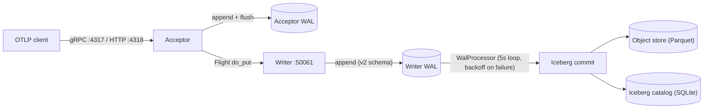
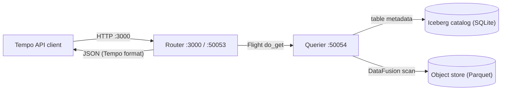

# SignalDB Architecture Overview

## Introduction

SignalDB is a distributed observability signal database built on the FDAP stack (Flight, DataFusion, Arrow, Parquet). It ingests metrics, logs, and traces via native OTLP support, stores them in Apache Iceberg tables backed by Parquet files, and exposes a Tempo-compatible query API. SignalDB supports multi-tenancy with per-tenant and per-dataset isolation at the storage, WAL, and catalog layers.

## Architecture Principles

### 1. Flight-First Communication

Apache Arrow Flight serves as the primary inter-service communication protocol:

- **Zero-copy data transfer** using the native Arrow columnar format
- **Streaming capabilities** for large dataset transfer between services
- **Connection pooling** with configurable limits, timeouts, and expiry
- **gRPC-based** with built-in TLS and authentication support

### 2. WAL-Based Durability

Write-Ahead Logging ensures data persistence and crash recovery:

- **Before acknowledgment**: Data written to WAL before client response
- **Automatic recovery**: Unprocessed entries replayed on restart
- **Per-tenant/dataset isolation**: Separate WAL directories per tenant, dataset, and signal type
- **Segment management**: Automatic rotation, compaction, and cleanup of processed segments

### 3. Dual Catalog System

SignalDB maintains two distinct catalog systems:

- **Service Catalog** (`Catalog`): PostgreSQL or SQLite-backed registry for service discovery, tenant management, API keys, and datasets. Used by `ServiceBootstrap` for heartbeat-based registration.
- **Iceberg Catalog** (`CatalogManager`): SQL catalog named `"signaldb"` for Iceberg table metadata (schemas, snapshots, manifests). Only SQLite URIs are accepted (file-backed or in-memory; PostgreSQL is rejected -- see `create_sql_catalog_with_builder` in `src/common/src/iceberg/mod.rs`). Shared across all services via `Arc<dyn IcebergCatalog>`.

### 4. Apache Iceberg Table Format

Apache Iceberg provides ACID transactions and structured metadata management:

- **ACID transactions** with commit/rollback for data integrity
- **Schema versioning** via `schemas.toml` with inheritance, field renames, and computed fields
- **Hour-based partitioning** on `timestamp` for all table types
- **Namespace isolation**: Tables namespaced as `[tenant_slug, dataset_slug]`

### 5. Columnar Storage

Parquet storage with DataFusion query processing:

- **Arrow-native processing** throughout the entire pipeline
- **Columnar compression** for cost-effective storage
- **SQL query capabilities** via DataFusion with Iceberg integration
- **Object store abstraction** supporting local filesystem, S3/MinIO, and in-memory backends

## System Architecture

### Workspace Members

| Crate | Path | Type | Description |
|-------|------|------|-------------|
| **acceptor** | `src/acceptor/` | Binary + Library | OTLP gRPC/HTTP ingestion endpoint |
| **router** | `src/router/` | Binary + Library | HTTP API + Flight routing layer |
| **writer** | `src/writer/` | Binary + Library | Iceberg-based data persistence (the "Ingester") |
| **querier** | `src/querier/` | Binary + Library | Query execution engine via DataFusion |
| **compactor** | `src/compactor/` | Binary + Library | Storage maintenance: compaction, retention (bin `signaldb-compactor`) |
| **common** | `src/common/` | Library | Shared config, auth, WAL, Flight, catalog, schema |
| **tempo-api** | `src/tempo-api/` | Library | Grafana Tempo API types and protobuf definitions |
| **signaldb-bin** | `src/signaldb-bin/` | Binary | Monolithic mode runner (all services in one process) |
| **signaldb-api** | `src/signaldb-api/` | Library | OpenAPI-generated admin API types |
| **signaldb-cli** | `src/signaldb-cli/` | Binary | CLI and TUI for tenant, API key, and dataset management |
| **signaldb-sdk** | `src/signaldb-sdk/` | Library | Generated SDK client |
| **grafana-plugin** | `src/grafana-plugin/backend` | Plugin | Grafana datasource (TypeScript frontend + Rust backend; the backend crate is the workspace member) |
| **signal-producer** | `src/signal-producer/` | Binary | Test data generator (OTLP traces) |
| **tests-integration** | `tests-integration/` | Test crate | Integration test suite |
| **xtask** | `xtask/` | Binary | Build automation tasks |

### Data Flow Overview

Write path — both the Acceptor and the Writer keep their own WAL; the client is
acknowledged once data is durable in both, and Parquet is written asynchronously:



Query path:



### Write Path Detail

1. **OTLP Ingestion**: Client sends traces/logs/metrics via gRPC (port 4317) or HTTP (port 4318) to the Acceptor. The Acceptor also supports Prometheus remote_write at `/api/v1/write`.
2. **Authentication**: Acceptor validates the API key via `Authorization: Bearer <key>` header, resolves tenant and dataset context.
3. **OTLP-to-Arrow Conversion**: Acceptor converts OTLP protobuf data to Arrow RecordBatches using Flight schemas (v1 format).
4. **Acceptor WAL**: Acceptor appends the Arrow batch to its own WAL (per tenant/dataset/signal type) and flushes it before forwarding.
5. **Flight Transfer**: Acceptor sends Arrow RecordBatches to a Writer via Flight `do_put`, discovered by `Storage` capability.
6. **Schema Transformation**: Writer transforms v1 Flight schema to v2 Iceberg schema (field renames, type conversions, computed partition fields).
7. **Writer WAL Persistence**: Writer writes transformed data to its WAL (segmented by tenant/dataset/signal type) and confirms to the Acceptor.
8. **Client Acknowledgment**: Acceptor marks its WAL entry processed and acknowledges to the client.
9. **Background Flush**: Writer's `WalProcessor` reads WAL entries every 5 seconds (with exponential backoff up to 300s on repeated failures), creates/loads Iceberg tables, and writes Parquet files to the object store via DataFusion.
10. **WAL Cleanup**: Processed WAL entries are marked and fully-processed segments are deleted.

### Query Path Detail

1. **HTTP Request**: Client sends a query to the Router's HTTP API (port 3000), e.g., `GET /tempo/api/traces/{trace_id}`.
2. **Authentication**: Router validates API key and resolves tenant/dataset context.
3. **Service Discovery**: Router discovers available Querier services via `QueryExecution` capability from the service catalog.
4. **Flight Query**: Router forwards the query as a Flight `do_get` ticket to the Querier (port 50054). Tickets encode the query type and tenant context, e.g., `find_trace:{tenant_slug}:{dataset_slug}:{trace_id}`.
5. **DataFusion Execution**: Querier resolves the tenant catalog and dataset schema, builds a DataFusion query against the Iceberg table, and executes it against Parquet files in the object store.
6. **Result Streaming**: Results streamed back as Arrow RecordBatches via Flight to the Router.
7. **Client Response**: Router formats the response as JSON (Tempo API format) and returns it to the client.

## Service Components

### Acceptor

**Purpose**: OTLP data ingestion with multi-protocol support

| Property | Value |
|----------|-------|
| **Ports** | gRPC: 4317, HTTP: 4318 |
| **Capability** | `TraceIngestion` |
| **Protocols** | OTLP/gRPC, OTLP/HTTP, Prometheus remote_write |
| **Signal types** | Traces, Logs, Metrics |

- Runs separate gRPC (tonic) and HTTP (Axum) servers in parallel
- `WalManager` creates per-tenant/dataset/signal WAL instances with tuned configs:
  - Traces: 1000 entries, 30s flush
  - Logs: 2000 entries, 15s flush
  - Metrics: 5000 entries, 10s flush
- Converts OTLP protobuf to Arrow RecordBatches using `FlightSchemas`
- Discovers Writers via `Storage` capability and sends data via Flight `do_put`

### Writer

**Purpose**: Data persistence to Apache Iceberg tables

| Property | Value |
|----------|-------|
| **Port** | Flight: 50061 (standalone), 50051 (monolithic) |
| **Capabilities** | `TraceIngestion`, `Storage` |
| **Input** | Arrow data via Flight `do_put` from Acceptors |
| **Output** | Iceberg tables (Parquet + metadata) to object store |

- `IcebergWriterFlightService`: Flight server accepting `do_put` for trace/log/metric data
- Transforms v1 Flight schema to v2 Iceberg schema before WAL write
- `WalProcessor`: Background task (5s interval, exponential backoff on failure) that reads WAL entries and writes to Iceberg tables
- Caches `IcebergTableWriter` instances per `{tenant}:{dataset}:{table}` combination
- Creates Iceberg tables on first write with schema and partition spec from `iceberg_schemas`

### Router

**Purpose**: HTTP API gateway and query routing

| Property | Value |
|----------|-------|
| **Ports** | HTTP: 3000, Flight: 50053 |
| **Capability** | `Routing` |
| **APIs** | Tempo-compatible, Admin API, OpenAPI |

**Tempo API Endpoints**:

| Endpoint | Status |
|----------|--------|
| `GET /tempo/api/echo` | Implemented |
| `GET /tempo/api/traces/{trace_id}` | Implemented -- routes to Querier |
| `GET /tempo/api/v2/traces/{trace_id}` | Implemented -- same handler as v1 |
| `GET /tempo/api/search` | Implemented -- routes to Querier |
| `GET /tempo/api/search/tags` | Implemented -- static list of resource + intrinsic tag names |
| `GET /tempo/api/search/tag/{tag_name}/values` | Implemented -- distinct column values via Querier; 501 for attribute tags without an index |
| `GET /tempo/api/v2/search/tags` | Implemented -- same tag names, v2 scoped response |
| `GET /tempo/api/v2/search/tag/{tag_name}/values` | Implemented -- same lookup, v2 response shape |
| `GET /tempo/api/metrics/query` | 501 Not Implemented (TraceQL metrics) |
| `GET /tempo/api/metrics/query_range` | 501 Not Implemented (TraceQL metrics) |

**Admin API Endpoints** (requires `admin_api_key`):

| Endpoint | Description |
|----------|-------------|
| `/api/v1/admin/tenants` | CRUD for tenants |
| `/api/v1/admin/tenants/{id}/api-keys` | Manage tenant API keys |
| `/api/v1/admin/tenants/{id}/datasets` | Manage tenant datasets |

- `ServiceRegistry`: Maintains cached map of discovered services, polls catalog at configurable interval
- Discovers Queriers via `QueryExecution` capability for query forwarding

### Querier

**Purpose**: Query execution against Iceberg tables via DataFusion

| Property | Value |
|----------|-------|
| **Port** | Flight: 50054 (standalone mode also serves Tempo's `tempopb.Querier` gRPC protocol on this port) |
| **Capability** | `QueryExecution` |
| **Engine** | DataFusion with Iceberg integration |

- Creates a DataFusion `SessionContext` with per-tenant `TenantCatalog` wrappers
- `TenantCatalog` bridges DataFusion's 3-level model (`catalog.schema.table`) to Iceberg's 2-level namespace (`[tenant_slug, dataset_slug]`)
- Registers per-dataset object stores with DataFusion's runtime environment
- Handles Flight `do_get` tickets:
  - `find_trace:{tenant_slug}:{dataset_slug}:{trace_id}[:{start}:{end}]` -- single trace lookup with optional unix-second time hints
  - `search_traces:{tenant_slug}:{dataset_slug}:{params}` -- trace search with filters
- Uses `TableReference::full(tenant_slug, dataset_slug, "traces")` with slug validation to prevent SQL injection

### Compactor

**Purpose**: Storage maintenance -- Parquet compaction and data lifecycle

| Property | Value |
|----------|-------|
| **Ports** | Flight admin: 50055 (standalone, `COMPACTOR_FLIGHT_ADDR`), metrics HTTP: 9091 (`[compactor].metrics_addr`) |
| **Capability** | `StorageMaintenance` |
| **Binary** | `signaldb-compactor` |

- Plans compaction candidates from Iceberg manifest data on a `tick_interval` loop
- Distributed leases (`compactor_leases` catalog table) prevent concurrent compaction of the same partition
- Flight admin interface exposes only `do_action` commands (`compact_now`, `compact_status`, `compact_dry_run`) and `list_actions`; all other Flight RPCs return `unimplemented`
- Retention enforcement and orphan-file cleanup, configured via `[compactor.retention]` and `[compactor.orphan_cleanup]`
- Disabled by default; enable with `[compactor].enabled = true`

## Multi-Tenancy and Authentication

### Tenant Model

SignalDB provides full multi-tenant isolation:

```
Tenant (e.g., "acme")
  ├── API Keys (SHA-256 hashed, with revocation support)
  ├── Datasets
  │   ├── "production" (slug: "prod", default)
  │   └── "staging" (slug: "staging")
  └── Schema Config (optional per-tenant overrides)
```

### Authentication Flow

1. Client sends `Authorization: Bearer <api-key>` with a required `X-Tenant-ID` header and an optional `X-Dataset-ID` header
2. `Authenticator` hashes the key (SHA-256) and checks:
   - Config-based API keys first (from `signaldb.toml`)
   - Database-backed API keys second (from service catalog)
3. Validates tenant_id matches the key's tenant (403 on mismatch)
4. Resolves dataset: explicit header -> tenant default_dataset -> first `is_default` dataset -> 400 error
5. Returns `TenantContext` with tenant_id, dataset_id, tenant_slug, dataset_slug

### Isolation Layers

| Layer | Isolation Mechanism |
|-------|-------------------|
| **WAL** | Separate directories: `{wal_dir}/{tenant}/{dataset}/{signal_type}/` |
| **Iceberg Namespace** | Per-tenant/dataset: `[tenant_slug, dataset_slug]` |
| **Object Store** | Per-tenant/dataset paths: `{base}/{tenant_slug}/{dataset_slug}/{table}/` |
| **DataFusion** | Per-tenant catalog registration in SessionContext |
| **Storage Backend** | Per-dataset storage override (different datasets can use different backends) |

### Configuration

```toml
[auth]
admin_api_key = "sk-admin-key"

[[auth.tenants]]
id = "acme"
slug = "acme"
name = "Acme Corporation"
default_dataset = "production"

[[auth.tenants.datasets]]
id = "production"
slug = "prod"
is_default = true

[[auth.tenants.datasets]]
id = "archive"
slug = "archive"
# Per-dataset storage override
[auth.tenants.datasets.storage]
dsn = "s3://acme-archive/signals"

[[auth.tenants.api_keys]]
key = "sk-acme-prod-key-123"
name = "Production Key"
```

## Service Discovery

### Capability-Based Routing

Services register with specific capabilities enabling automatic routing:

| Service | Capabilities | Discovery Pattern |
|---------|-------------|------------------|
| Acceptor | `TraceIngestion` | Clients connect directly via OTLP |
| Writer | `TraceIngestion`, `Storage` | Acceptors discover via `Storage` capability |
| Router | `Routing` | Clients connect directly via HTTP |
| Querier | `QueryExecution` | Routers discover via `QueryExecution` capability |
| Compactor | `StorageMaintenance` | Registered for observability; not discovered by other services |

The `ServiceCapability` enum (`src/common/src/flight/transport.rs`) defines six variants: `TraceIngestion`, `QueryExecution`, `Routing`, `Storage`, `KafkaIngestion`, and `StorageMaintenance`. `KafkaIngestion` is defined but not registered by any service today.

### ServiceBootstrap Pattern

Each service creates a `ServiceBootstrap` at startup which:

1. Connects to the service catalog (SQLite or PostgreSQL, from `[discovery]` or `[database]` DSN)
2. Generates a unique UUID `service_id`
3. Registers in the `ingesters` table with service_type, address, and capabilities (comma-separated)
4. Spawns a background heartbeat task updating `last_seen` at the configured interval
5. On shutdown, deregisters from the catalog and stops the heartbeat

### Discovery Mechanism

- `InMemoryFlightTransport`: Provides connection pooling (max 50 connections, 30s timeout, 5min expiry) and capability-based client lookup
- `ServiceRegistry` (Router-specific): Cached HashMap of services, polls catalog at configurable interval
- Service selection: round-robin across healthy instances (stable rotation order sorted by service id)
- Automatic TTL-based cleanup removes stale services that stop heartbeating

## Schema Management

Schema definitions are managed in `schemas.toml` at the repository root and compiled into the binary via `include_str!`. The schema system supports:

- **Versioned schemas** with metadata tracking current versions (e.g., traces v2, logs v1, metrics v1)
- **Inheritance**: A schema version can inherit fields from a parent version
- **Field renames**: e.g., `name` -> `span_name` in traces v2
- **Field additions**: e.g., `timestamp`, `date_day`, `hour` computed partition fields
- **Computed fields**: Fields derived from other fields at write time (e.g., `date_day` from `start_time_unix_nano`)

The Flight wire format (v1) and Iceberg storage format (v2) differ intentionally. The Writer applies schema transformations at ingestion time via `transform_trace_v1_to_v2()`.

For full details on table schemas, partitioning, and the object store layout, see [Storage Layout Design](storage-layout.md).

## Deployment Models

### Monolithic Mode

**Use Cases**: Development, small deployments, testing

```bash
cargo run --bin signaldb
```

Starts Acceptor, Router, Writer, and Querier in a single process:
- Acceptor: `0.0.0.0:4317` (gRPC), `0.0.0.0:4318` (HTTP)
- Router: `0.0.0.0:3000` (HTTP), `0.0.0.0:50053` (Flight)
- Writer: `0.0.0.0:50051` (Flight)
- Querier: `0.0.0.0:50054` (Flight)

When `[compactor].enabled = true`, the monolithic binary also runs the compactor planning loop (no compactor Flight/HTTP endpoints in this mode).

Shared SQLite database for both service catalog and Iceberg catalog. Zero-config startup with sensible defaults.

### Microservices Mode

**Use Cases**: Production, scalable deployments, cloud environments

```bash
cargo run --bin signaldb-acceptor   # OTLP ingestion (:4317, :4318)
cargo run --bin signaldb-router     # HTTP API (:3000, :50053)
cargo run --bin signaldb-writer     # Data persistence (:50061)
cargo run --bin signaldb-querier    # Query execution (:50054)
```

Independent processes with network Flight communication. Requires shared catalog access (PostgreSQL or shared SQLite) for service discovery.

### Hybrid Mode

Mixed deployment where some services are co-located and others are distributed. Discovery handles both local and remote services transparently.

## Grafana Integration

### Native Datasource Plugin

The Grafana plugin (`src/grafana-plugin/`) provides a native datasource with:

- **TypeScript frontend**: React-based query editor and config editor using `@grafana/data` and `@grafana/ui`
- **Rust backend**: Uses `grafana-plugin-sdk` to connect to the Router's Flight service (default `http://localhost:50053`)
- **Auth passthrough**: Passes API key, tenant ID, and dataset ID from Grafana secure JSON config to Flight headers
- **Signal support**: Traces, metrics, and logs query types
- **Arrow conversion**: Direct Arrow RecordBatch to Grafana Frame conversion

### Tempo API Compatibility

The Router exposes Tempo-compatible endpoints at `/tempo/api/...` for direct use with Grafana's built-in Tempo datasource. Supports trace lookup by ID, trace search, tag-name listing, and tag-value lookup for indexed columns (v1 and v2 variants). TraceQL metrics endpoints (`/metrics/query`, `/metrics/query_range`) return 501 Not Implemented.

## Configuration

**Precedence**: defaults -> TOML file (`signaldb.toml`) -> environment variables (`SIGNALDB_*`)

```toml
# Service catalog / discovery
[database]
dsn = "sqlite://.data/signaldb.db"

[discovery]
dsn = "sqlite://.data/signaldb.db"   # Falls back to [database].dsn
heartbeat_interval = "30s"
poll_interval = "60s"
ttl = "300s"

# Object store for Parquet data
[storage]
dsn = "file:///.data/storage"
# dsn = "memory://"
# dsn = "s3://bucket/prefix"

# WAL configuration
[wal]
wal_dir = ".data/wal"
max_segment_size = 67108864          # 64 MB
max_buffer_entries = 1000
flush_interval = "30s"

# Iceberg catalog
[schema]
catalog_type = "sql"
catalog_uri = "sqlite::memory:"      # or sqlite:///path/to/catalog.db
```

For S3/MinIO, set environment variables:

```bash
AWS_ENDPOINT_URL=http://localhost:9000
AWS_ACCESS_KEY_ID=minioadmin
AWS_SECRET_ACCESS_KEY=minioadmin
AWS_REGION=us-east-1
```

## Operational Characteristics

### Health Endpoints

```bash
curl http://localhost:4318/health   # Acceptor
curl http://localhost:3000/health   # Router
```

### Disaster Recovery

- **WAL-Based Recovery**: Unprocessed WAL entries automatically replayed on Writer restart
- **Segment Management**: Fully-processed segments deleted, partially-processed segments compacted
- **Service Failure**: Automatic TTL-based deregistration; discovery cache invalidation on changes
- **Graceful Shutdown**: Services deregister from catalog, flush WAL, and stop heartbeat on shutdown

### Security

- **API Key Authentication**: SHA-256 hashed keys with config-based and database-backed storage
- **Internal Flight Auth**: Optional `[auth].internal_service_key` shared secret gates service-to-service Flight calls (writer 50051, router 50053, querier 50054, compactor 50055); when unset, the Flight ports accept unauthenticated calls and must be restricted to a trusted network
- **Rate Limits**: `[auth].default_limits` sets default per-tenant ingest limits, overridable per tenant
- **Storage Quotas**: `max_storage_bytes` caps a tenant's live Iceberg data-file bytes; usage is refreshed periodically from table metadata and over-quota ingest is rejected with 429 / RESOURCE_EXHAUSTED (`quota_exceeded`)
- **Admin API**: Separate admin key for tenant/dataset management
- **Input Validation**: Tenant/dataset slugs validated against alphanumeric + hyphen pattern; path traversal checks (`../`)
- **TLS**: Flight supports gRPC-level TLS encryption
- **gRPC Auth**: Separate interceptor for tonic gRPC services using metadata headers

## CLI Tool

`signaldb-cli` provides command-line management for tenants, API keys, and datasets, plus an interactive terminal UI (ratatui-based):

```bash
signaldb-cli tenant list
signaldb-cli tenant create acme --name "Acme Corp"
signaldb-cli api-key create acme --name "Production Key"
signaldb-cli dataset create acme --name production
```

## Testing

```bash
cargo test                          # All tests across workspace
cargo test -p <package>             # Tests for specific package
cargo test -p tests-integration     # Integration tests
```

The integration test suite (`tests-integration/`) validates end-to-end data flow, service discovery, WAL durability, and Flight communication.
