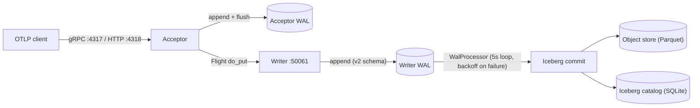
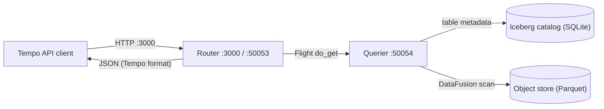

# SignalDB Architecture Overview

## Introduction

SignalDB is a distributed observability signal database built on the [FDAP stack](fdap.md) (Flight, DataFusion, Arrow, Parquet). It ingests metrics, logs, and traces via native OTLP support, stores them in Apache Iceberg tables backed by Parquet files, and exposes a Tempo-compatible query API. SignalDB supports multi-tenancy with per-tenant and per-dataset isolation at the storage, WAL, and catalog layers.

## Architecture Principles

### 1. Flight-First Communication

Apache Arrow Flight serves as the primary inter-service communication protocol:

- **Zero-copy data transfer** using the native Arrow columnar format
- **Streaming capabilities** for large dataset transfer between services
- **Connection pooling** with configurable limits, timeouts, and expiry
- **gRPC-based** with built-in TLS and authentication support

### 2. WAL-Based Durability

Write-Ahead Logging ensures data persistence and crash recovery:

- **Before acknowledgment**: Data written to WAL before client response
- **Automatic recovery**: Unprocessed entries replayed on restart
- **Per-tenant/dataset isolation**: Separate WAL directories per tenant, dataset, and signal type
- **Segment management**: Automatic rotation, compaction, and cleanup of processed segments

### 3. Dual Catalog System

SignalDB maintains two distinct catalog systems:

- **Service Catalog** (`Catalog`): PostgreSQL or SQLite-backed registry for service discovery, tenant management, API keys, and datasets. Used by `ServiceBootstrap` for heartbeat-based registration. At monolith startup, config tenants are synced into it; if no tenants exist at all, a `default` tenant is auto-provisioned and its API key printed once (`common::bootstrap`). The router and monolith also run `Catalog::backfill_default_datasets` at boot, which materializes a `datasets` row for any tenant naming a `default_dataset` without one — a state tenant creation no longer produces, but that older deployments carry, and one that fails authentication closed (#1066). It is a no-op once converged.
- **Iceberg Catalog** (`CatalogManager`): SQL catalog named `"signaldb"` for Iceberg table metadata (schemas, snapshots, manifests). Only SQLite URIs are accepted (file-backed or in-memory; PostgreSQL is rejected -- see `create_sql_catalog_with_builder` in `src/common/src/iceberg/mod.rs`). Shared across all services via `Arc<dyn IcebergCatalog>`.

### 4. Apache Iceberg Table Format

Apache Iceberg provides ACID transactions and structured metadata management:

- **ACID transactions** with commit/rollback for data integrity
- **Schema versioning** via `schemas.toml` with inheritance, field renames, and computed fields — the physical schema source of truth for all six built-in table types (traces, logs, and all five metrics representations plus profiles), not only traces/logs
- **Hour-based partitioning** on `timestamp` for all table types
- **Namespace isolation**: Tables namespaced as `[tenant_slug, dataset_slug]`
- **Materialized labels**: configured attribute keys promoted to dedicated
  columns for exact querying across all four signal types; allowlists
  resolve per tenant (a tenant schema override replaces the global set —
  see [storage layout](storage-layout.md#materialized-labels))
- **Typed attribute maps**: new tables across all four signals store
  attributes as `Map<String,String>` columns, so any attribute is exactly queryable
  (legacy tables keep JSON strings with per-table fallback)

### 5. Columnar Storage

Parquet storage with DataFusion query processing:

- **Arrow-native processing** throughout the entire pipeline
- **Columnar compression** for cost-effective storage
- **SQL query capabilities** via DataFusion with Iceberg integration
- **Object store abstraction** supporting local filesystem, S3/MinIO, and in-memory backends

## System Architecture

### Workspace Members

| Crate                 | Path                         | Type       | Description                                                                                                                                                                              |
| --------------------- | ---------------------------- | ---------- | ---------------------------------------------------------------------------------------------------------------------------------------------------------------------------------------- |
| **acceptor**          | `src/acceptor/`              | Library    | OTLP gRPC/HTTP ingestion endpoint                                                                                                                                                        |
| **router**            | `src/router/`                | Library    | HTTP API + Flight routing layer                                                                                                                                                          |
| **writer**            | `src/writer/`                | Library    | Iceberg-based data persistence (the "Ingester")                                                                                                                                          |
| **querier**           | `src/querier/`               | Library    | Query execution engine via DataFusion                                                                                                                                                    |
| **compactor**         | `src/compactor/`             | Library    | Storage maintenance: compaction, retention (`signaldb compactor`)                                                                                                                        |
| **common**            | `src/common/`                | Library    | Shared config, auth, WAL, Flight, catalog, schema                                                                                                                                        |
| **pyroscope-api**     | `src/pyroscope-api/`         | Library    | Pyroscope-compatible API types (flamebearer, profile types)                                                                                                                              |
| **tempo-api**         | `src/tempo-api/`             | Library    | Grafana Tempo API types and protobuf definitions                                                                                                                                         |
| **loki-api**          | `src/loki-api/`              | Library    | Loki HTTP API response types (LogQL query surface)                                                                                                                                       |
| **prometheus-api**    | `src/prometheus-api/`        | Library    | Prometheus HTTP API response types (PromQL query surface)                                                                                                                                |
| **schema-model**      | `src/schema-model/`          | Library    | OTel Weaver semantic-convention model: parser, resolver (flat attribute/entity/metric definitions), and the validator applied to custom schema registries                                |
| **signaldb-bin**      | `src/signaldb-bin/`          | Binary     | The `signaldb` executable: monolith by default, or one service via a subcommand (`signaldb router`, …); every service crate exposes `cli::Args` + `cli::run`                             |
| **signaldb-api**      | `src/signaldb-api/`          | Library    | Hand-written admin API DTOs (utoipa `ToSchema`); OpenAPI schema source — see [OpenAPI codegen](openapi-codegen.md)                                                                       |
| **signaldb-cli**      | `src/signaldb-cli/`          | Binary     | CLI and TUI for tenant, API key, and dataset management                                                                                                                                  |
| **signaldb-sdk**      | `src/signaldb-sdk/`          | Library    | Generated Rust HTTP client (progenitor) for the admin API                                                                                                                                |
| **mcp-server**        | `src/mcp-server/`            | Library    | Model Context Protocol server (`signaldb mcp`); credential-forwarding client over `signaldb-sdk`, serves MCP at `/mcp` — see [MCP server](../users/mcp.md)                               |
| **grafana-plugin**    | `src/grafana-plugin/backend` | Plugin     | Grafana datasource (TypeScript frontend + Rust backend; the backend is a standalone cargo workspace excluded from the root workspace, since grafana-plugin-sdk pins its own Arrow major) |
| **signal-producer**   | `src/signal-producer/`       | Binary     | Test data generator (OTLP traces)                                                                                                                                                        |
| **tests-integration** | `tests-integration/`         | Test crate | Integration test suite                                                                                                                                                                   |
| **xtask**             | `xtask/`                     | Binary     | Code generation (OpenAPI-derived Rust SDK + TypeScript UI client) and build tasks                                                                                                        |

### Data Flow Overview

Write path — both the Acceptor and the Writer keep their own WAL; the client is
acknowledged once data is durable in both, and Parquet is written asynchronously:


```mermaid
flowchart LR
    Client["OTLP client"] -->|"gRPC :4317 / HTTP :4318"| Acceptor
    Acceptor -->|"append + flush"| AWal[("Acceptor WAL")]
    Acceptor -->|"Flight do_put"| Writer["Writer :50061"]
    Writer -->|"append (v2 schema)"| WWal[("Writer WAL")]
    WWal -->|"WalProcessor (5s loop, backoff on failure)"| Iceberg["Iceberg commit"]
    Iceberg --> Store[("Object store (Parquet)")]
    Iceberg --> Cat[("Iceberg catalog (SQLite)")]
```

Query path:


```mermaid
flowchart LR
    Client["Tempo API client"] -->|"HTTP :3000"| Router["Router :3000 / :50053"]
    Router -->|"Flight do_get"| Querier["Querier :50054"]
    Querier -->|"table metadata"| Cat[("Iceberg catalog (SQLite)")]
    Querier -->|"DataFusion scan"| Store[("Object store (Parquet)")]
    Router -->|"JSON (Tempo format)"| Client
```

### Write Path Detail

1. **OTLP Ingestion**: Client sends traces/logs/metrics via gRPC (port 4317) or HTTP (port 4318) to the Acceptor. The Acceptor also supports Prometheus remote_write at `/api/v1/write`.
2. **Authentication**: Acceptor validates the API key via `Authorization: Bearer <key>` header, resolves tenant and dataset context.
3. **OTLP-to-Arrow Conversion**: Acceptor converts OTLP protobuf data to Arrow RecordBatches using Flight schemas (v1 format).
4. **Acceptor WAL**: Acceptor appends the Arrow batch to its own WAL (per tenant/dataset/signal type) and flushes it before forwarding.
5. **Flight Transfer**: Acceptor sends Arrow RecordBatches to a Writer via Flight `do_put`, discovered by `Storage` capability.
6. **Schema Transformation**: Writer transforms v1 Flight schema to the physical-v3 Iceberg schema (field renames, type conversions, computed partition fields). On every table load (not just creation), the writer also brings an existing traces/logs table's schema forward to the current version if it's behind — see [Schema Management](#schema-management).
7. **Writer WAL Persistence**: Writer writes transformed data to its WAL (segmented by tenant/dataset/signal type) and confirms to the Acceptor.
8. **Client Acknowledgment**: Acceptor marks its WAL entry processed and acknowledges to the client.
9. **Background Flush**: Writer's `WalProcessor` reads WAL entries every 5 seconds (with exponential backoff up to 300s on repeated failures), creates/loads Iceberg tables, and writes Parquet files to the object store via DataFusion. Commits are **coalesced** per `(tenant, dataset, table)` (`[writer].commit_interval` / `max_uncommitted_rows`), so freshly-ingested data is queryable only once committed; a caller needing read-your-writes forces a commit with the Writer Flight `do_action("flush")`. See `architecture/flight-communication.md`.
10. **WAL Cleanup**: Processed WAL entries are marked and fully-processed segments are deleted.

### Query Path Detail

1. **HTTP Request**: Client sends a query to the Router's HTTP API (port 3000), e.g., `GET /tempo/api/traces/{trace_id}`.
2. **Authentication**: Router validates API key and resolves tenant/dataset context.
3. **Service Discovery**: Router discovers available Querier services via `QueryExecution` capability from the service catalog.
4. **Flight Query**: Router forwards the query as a Flight `do_get` ticket to the Querier (port 50054). Tickets encode the query type and tenant context, e.g., `find_trace:{tenant_slug}:{dataset_slug}:{trace_id}`.
5. **DataFusion Execution**: Querier resolves the tenant catalog and dataset schema, builds a DataFusion query against the Iceberg table, and executes it against Parquet files in the object store. Single-trace lookups (`find_trace`) prune Parquet row groups via the `trace_id` bloom filter — the only structure that helps a high-cardinality point lookup, since min/max statistics never do (see [Storage Layout](storage-layout.md#parquet-bloom-filters)).
6. **Result Streaming**: Results streamed back as Arrow RecordBatches via Flight to the Router.
7. **Client Response**: Router formats the response as JSON (Tempo API format) and returns it to the client, together with the server span's trace context and stage timings as response headers (`Server-Timing`/`traceresponse` — see [Trace Context on HTTP Responses](../users/response-trace-context.md)).

## Service Components

### Acceptor

**Purpose**: OTLP data ingestion with multi-protocol support

| Property         | Value                                         |
| ---------------- | --------------------------------------------- |
| **Ports**        | gRPC: 4317, HTTP: 4318                        |
| **Capability**   | `TraceIngestion`                              |
| **Protocols**    | OTLP/gRPC, OTLP/HTTP, Prometheus remote_write |
| **Signal types** | Traces, Logs, Metrics                         |

- Runs separate gRPC (tonic) and HTTP (Axum) servers in parallel
- `WalManager` creates per-tenant/dataset/signal WAL instances with tuned configs:
  - Traces: 1000 entries, 30s flush
  - Logs: 2000 entries, 15s flush
  - Metrics: 5000 entries, 10s flush
- Converts OTLP protobuf to Arrow RecordBatches using `FlightSchemas`
- Discovers Writers via `Storage` capability and sends data via Flight `do_put`

### Writer

**Purpose**: Data persistence to Apache Iceberg tables

| Property         | Value                                               |
| ---------------- | --------------------------------------------------- |
| **Port**         | Flight: 50061 (standalone), 50051 (monolithic)      |
| **Capabilities** | `TraceIngestion`, `Storage`                         |
| **Input**        | Arrow data via Flight `do_put` from Acceptors       |
| **Output**       | Iceberg tables (Parquet + metadata) to object store |

- `IcebergWriterFlightService`: Flight server accepting `do_put` for trace/log/metric data
- Transforms v1 Flight schema to v2 Iceberg schema before WAL write
- `WalProcessor`: Background task (5s interval, exponential backoff on failure) that reads WAL entries and writes to Iceberg tables
- Caches `IcebergTableWriter` instances per `{tenant}:{dataset}:{table}` combination
- Creates Iceberg tables with schema and partition spec from `iceberg_schemas` — on first write, and ahead of it via the table reconciler (`reconcile.rs`): a startup pass plus one every `[writer].table_reconcile_interval` over the tenant registry, so every registered tenant/dataset holds a table for each signal type enabled for it before any telemetry arrives. Both paths go through the same load-or-create `CatalogManager::ensure_table`, so a failing reconciler degrades to create-on-first-write. See [Signal table provisioning](../operations/table-provisioning.md)

### Router

**Purpose**: HTTP API gateway and query routing

| Property       | Value                                                                                                                                                             |
| -------------- | ----------------------------------------------------------------------------------------------------------------------------------------------------------------- |
| **Ports**      | HTTP: 3000, Flight: 50053                                                                                                                                         |
| **Capability** | `Routing`                                                                                                                                                         |
| **APIs**       | Tempo-compatible, Pyroscope-compatible, Loki-compatible (stubs), native Query IR (`POST /api/v1/query`), schema registry (`/api/v1/schema/*`), Admin API, OpenAPI |

The router also serves the explore UI (a static SPA built from `src/ui`)
under `/ui`, from the directory named by `SIGNALDB_UI_DIR`. See
[the explore UI guide](../users/explore-ui.md).

For browsers, the router exposes `POST`/`DELETE /ui/session`
(`src/router/src/endpoints/session.rs`): a public login endpoint that
validates a user's email/password, then creates or revokes an opaque
server-side session. The tenant is optional at login — the response
carries the user's memberships so the UI can offer a picker (a sole
membership is auto-selected); each request then re-validates the
`X-Tenant-ID` header against those memberships. `GET /api/v1/whoami`
returns the human identity and memberships plus the selected tenant's
datasets for the UI's tenant selector. API-key authentication remains
available for machine clients and ingestion.

**Tempo API Endpoints**:

| Endpoint                                         | Status                                                                                   |
| ------------------------------------------------ | ---------------------------------------------------------------------------------------- |
| `GET /tempo/api/echo`                            | Implemented                                                                              |
| `GET /tempo/api/traces/{trace_id}`               | Implemented -- routes to Querier                                                         |
| `GET /tempo/api/v2/traces/{trace_id}`            | Implemented -- same handler as v1                                                        |
| `GET /tempo/api/search`                          | Implemented -- routes to Querier                                                         |
| `GET /tempo/api/search/tags`                     | Implemented -- attribute keys observed in the window via Querier, plus fixed intrinsics  |
| `GET /tempo/api/search/tag/{tag_name}/values`    | Implemented -- distinct values via Querier for any tag; empty list for an unobserved one |
| `GET /tempo/api/v2/search/tags`                  | Implemented -- same discovery, scoped (resource/span/intrinsic)                          |
| `GET /tempo/api/v2/search/tag/{tag_name}/values` | Implemented -- same lookup, v2 response shape                                            |
| `GET /tempo/api/metrics/query`                   | 501 Not Implemented (TraceQL metrics)                                                    |
| `GET /tempo/api/metrics/query_range`             | 501 Not Implemented (TraceQL metrics)                                                    |

**Pyroscope API Endpoints** (profiles, nested at `/pyroscope` plus `/api/profiles`):

| Endpoint                                                        | Status                                    |
| --------------------------------------------------------------- | ----------------------------------------- |
| `GET /pyroscope/render`                                         | Implemented -- flamegraph via Querier     |
| `GET /pyroscope/render-diff`                                    | Implemented -- differential flamegraph    |
| `GET /pyroscope/label-names`, `/label-values`, `/profile-types` | Implemented -- discovery via Querier      |
| `GET /api/profiles/trace/{trace_id}`                            | Implemented -- profiles linked to a trace |

**Loki API Endpoints** (logs, nested at `/loki`; see epic #366):

| Endpoint                                                         | Status                                                                                                                                                                                                             |
| ---------------------------------------------------------------- | ------------------------------------------------------------------------------------------------------------------------------------------------------------------------------------------------------------------ |
| `GET /loki/api/v1/query`                                         | Implemented -- log query over a one-hour window ending at `time`                                                                                                                                                   |
| `GET /loki/api/v1/query_range`                                   | Implemented -- transpiles LogQL to a querier filter, returns Loki streams; trace context and log/resource attributes ride as per-entry structured metadata (flattened -- the wire format has no scope distinction) |
| `GET /loki/api/v1/labels`                                        | Implemented -- known + attribute label names via Querier                                                                                                                                                           |
| `GET /loki/api/v1/label/{name}/values`                           | Implemented -- distinct label values via Querier                                                                                                                                                                   |
| `GET /loki/api/v1/series`                                        | Implemented -- label sets matching a selector via Querier                                                                                                                                                          |
| `GET /loki/api/v1/detected_fields`                               | Implemented -- sampled attribute-field discovery (name, type, cardinality)                                                                                                                                         |
| `GET /loki/api/v1/tail`                                          | Not implemented (WebSocket streaming, #380)                                                                                                                                                                        |
| LogQL metric queries (`rate`, `count_over_time`, `sum by (...)`) | Implemented via `query_range` -- `date_bin(step)` bucketed matrix (no binary ops / `topk` / `quantile` yet)                                                                                                        |

**Prometheus API Endpoints** (metrics, nested at `/prometheus`; see epic #328):

| Endpoint                                                           | Status                                                                                                     |
| ------------------------------------------------------------------ | ---------------------------------------------------------------------------------------------------------- |
| `GET\|POST /prometheus/api/v1/query_range`                         | Implemented -- PromQL over `metrics_gauge`+`metrics_sum`, `date_bin(step)` matrix                          |
| `GET\|POST /prometheus/api/v1/query`                               | Implemented -- instant vector (latest sample per series)                                                   |
| `GET /prometheus/api/v1/labels`, `/label/{name}/values`, `/series` | Implemented -- metric label names/values and `{__name__, job}` series via Querier                          |
| `GET /prometheus/api/v1/label_stats`                               | Implemented -- SignalDB extension: per-label cardinality from the catalog's `attribute_stats` (no Querier) |
| PromQL `rate`/`increase`                                           | Implemented -- counter delta over `date_bin` buckets                                                       |
| PromQL `histogram_quantile(phi, metric)`                           | Implemented -- interpolated per series from `metrics_histogram` OTLP buckets                               |
| PromQL `histogram_quantile` over `rate()`, binary ops, `topk`      | Not implemented yet (#335)                                                                                 |

**Native Query IR** (`POST /api/v1/query`, `src/router/src/endpoints/query.rs`):
the first-party structured query surface the UI and CLI build against. The
router shapes the querier's Arrow batches into the declared envelope, encoding
attribute containers (`Map<Utf8,Utf8>`) as JSON objects rather than flattening
them to strings — the compatibility dialects lose the OTel resource/scope/record
distinction, the IR preserves it. `source_read_scope` gates a document's `from`
against the caller's `{signal}:read` scopes (`logs`/`traces`/`profiles`/`metrics`,
with `metrics_histogram` mapped to the same `metrics` scope) before the request
ever reaches the querier. See [the Query IR reference](../users/querying-ir.md).

**Admin API Endpoints** (requires `admin_api_key`):

| Endpoint                              | Description            |
| ------------------------------------- | ---------------------- |
| `/api/v1/admin/tenants`               | CRUD for tenants       |
| `/api/v1/admin/tenants/{id}/api-keys` | Manage tenant API keys |
| `/api/v1/admin/tenants/{id}/datasets` | Manage tenant datasets |

- `ServiceRegistry`: Maintains cached map of discovered services, polls catalog at configurable interval
- Discovers Queriers via `QueryExecution` capability for query forwarding

### Querier

**Purpose**: Query execution against Iceberg tables via DataFusion

| Property       | Value                                                                                            |
| -------------- | ------------------------------------------------------------------------------------------------ |
| **Port**       | Flight: 50054 (standalone mode also serves Tempo's `tempopb.Querier` gRPC protocol on this port) |
| **Capability** | `QueryExecution`                                                                                 |
| **Engine**     | DataFusion with Iceberg integration                                                              |

- Creates a DataFusion `SessionContext` with per-tenant `TenantCatalog` wrappers
- `TenantCatalog` bridges DataFusion's 3-level model (`catalog.schema.table`) to Iceberg's 2-level namespace (`[tenant_slug, dataset_slug]`)
- Registers per-dataset object stores with DataFusion's runtime environment
- Handles Flight `do_get` tickets:
  - `find_trace:{tenant_slug}:{dataset_slug}:{trace_id}[:{start}:{end}]` -- single trace lookup with optional unix-second time hints
  - `search_traces:{tenant_slug}:{dataset_slug}:{params}` -- trace search with filters
- Uses `TableReference::full(tenant_slug, dataset_slug, "traces")` with slug validation to prevent SQL injection

### Compactor

**Purpose**: Storage maintenance -- Parquet compaction and data lifecycle

| Property       | Value                                                                                                      |
| -------------- | ---------------------------------------------------------------------------------------------------------- |
| **Ports**      | Flight admin: 50055 (standalone, `COMPACTOR_FLIGHT_ADDR`), metrics HTTP: 9091 (`[compactor].metrics_addr`) |
| **Capability** | `StorageMaintenance`                                                                                       |
| **Binary**     | `signaldb-compactor`                                                                                       |

- Plans compaction candidates from Iceberg manifest data on a `tick_interval` loop, one candidate per closed `timestamp_hour` partition. A partition is closed once its hour has ended and `[compactor] partition_lateness` has elapsed; the partition still receiving writes is never selected
- Executes one partition per job and commits a _delta_ — the input files are removed and the compacted outputs added in one snapshot, leaving every other partition referenced unchanged. Concurrent ingest therefore does not invalidate the commit; only a change to the job's own input files does. The rewrite **streams** that partition in two passes — an unsorted scan that gathers attribute statistics, then a sorted scan that feeds the writer — both under `[compactor] memory_limit_mb` and spilling past it, so peak job memory tracks one output file rather than the partition (the service warns at startup when `memory_limit_mb`, `target_file_size_mb` and `target_partitions` are set to values that cannot work together)
- Scheduling is round-robin across tenants with per-tenant and per-cycle caps, and the scheduler carries the one piece of cross-cycle state planning has no room for: a cooldown on partitions whose compaction just failed. Planning is stateless — it re-derives candidates from file count and size every tick — so without this a partition that cannot commit stays eligible forever and is retried every `tick_interval` indefinitely. A failure suppresses its partition for 15 minutes, doubling per consecutive failure to a 6-hour ceiling; a success clears the entry and resets the escalation. Suppressed partitions are dropped before the per-tenant cap is applied, so they cannot occupy a slot they are then skipped from. Commit conflicts are pointedly not failures here — a conflict means another actor committed first, which is contention to retry rather than a partition that is stuck (`compactor_cooldown_partitions_skipped_total`)
- Distributed leases (`compactor_leases` catalog table) prevent concurrent compaction of the same partition; leases abandoned by a crashed instance are swept every 30s by a task of its own, so a long compaction pass never delays recovery
- A failed job attempt is classified before the executor decides what to do with it: lost commit races and transient infrastructure failures (object store, network, catalog contention) share one bounded exponential-backoff budget, while deterministic failures — validation, schema, malformed input — fail on the first attempt rather than repeating a full rewrite to reach the same error. Only positive evidence marks a failure transient, so an unrecognized failure mode fails fast rather than silently costing three rewrites
- The four lifecycle cycles — compaction, lease expiry, retention, orphan cleanup — each run on their own task at their own cadence, so none can postpone another. Three of the four then take turns per table: a lock registry keyed by `(tenant, dataset, table)` serializes compaction commits, retention partition drops, and snapshot expiration, so those actors never act on one table at once while different tables proceed independently. Lease expiry and orphan cleanup's deletion pass do not take the lock — the former touches no table metadata, and the latter is guarded instead by its live-set check and its unconditional pre-delete re-validation. Compaction acquires it inside `execute_candidate`, which covers both the background cycle and the `compact_now` Flight action; retention acquires it across drop-plus-expire, which covers both the retention cycle and the orphan-cleanup pass that pre-expires snapshots through the same enforcer. This is an in-process ordering that removes the compactor's self-conflicts; across instances, safety still rests on catalog CAS and on the delta commit validating its own input files. Every iteration is also guarded with `catch_unwind` — a panic is caught, counted (`compactor_cycle_panics_total`/`compactor_cycle_down`), and retried with backoff instead of ending its cycle's task permanently; `/health` stays a pure liveness probe (`200` regardless) so a recovering cycle never trips a container restart, but the guard only fires under an unwinding panic strategy — this workspace's `[profile.release]` sets `panic = "abort"`, so it is not yet load-bearing in a release build
- Flight admin interface exposes only `do_action` commands (`compact_now`, `compact_status`, `compact_dry_run`) and `list_actions`; all other Flight RPCs return `unimplemented`
- Retention enforcement and orphan-file cleanup, configured via `[compactor.retention]` and `[compactor.orphan_cleanup]`. Orphan detection derives its live-file set from the union of the retained snapshots' manifests, never from snapshot age; a re-validation pass rebuilds that set immediately before each real deletion batch, unconditionally (a dry run still identifies candidates but skips the pass, because it deletes nothing)
- Advisory attribute-stats pass on every rewrite: logs per-key presence / approximate cardinality, persists the statistics to the catalog's `attribute_stats` table, and — when `[compactor.attr_promotion]` is enabled — computes a promotion/demotion decision (demand × presence under a schema-width budget with streak hysteresis; epic #737 Layer 4). With `dry_run = false` (default is `true`, log-only) promotions are acted on at rewrite: the table schema is evolved to add the `label_<key>` columns, then the rewrite backfills them from the attributes map and commits via the normal partition delta path
- Orphan cleanup logs one `DEBUG` line per deleted file and `INFO` per-batch/per-run summaries (a backlog pass can delete tens of thousands of files at startup)
- Enabled by default (retention enforcement with 30d for each of traces, logs, metrics and profiles, and orphan-file cleanup — data files and unreferenced metadata files alike); disable with `[compactor].enabled = false`, or `[compactor.orphan_cleanup].enabled = false` / `dry_run = true` for cleanup alone

## Multi-Tenancy and Authentication

### Tenant Model

SignalDB provides full multi-tenant isolation:

```
Tenant (e.g., "acme")
  ├── API Keys (SHA-256 hashed, with revocation support)
  ├── Datasets
  │   ├── "production" (slug: "prod", default)
  │   └── "staging" (slug: "staging")
  └── Schema Config (optional per-tenant overrides)
```

### Authentication Flow

1. Client sends `Authorization: Bearer <api-key>` with a required `X-Tenant-ID` header and an optional `X-Dataset-ID` header
2. `Authenticator` hashes the key (SHA-256) and checks:
   - Config-based API keys first (from `signaldb.toml`)
   - Database-backed API keys second (from service catalog)
3. Validates tenant_id matches the key's tenant (403 on mismatch)
4. Resolves dataset: explicit header -> tenant default_dataset -> first `is_default` dataset -> 400 error
5. Returns `TenantContext` with tenant_id, dataset_id, tenant_slug, dataset_slug

Two further credential types resolve to the same `TenantContext`: the
`signaldb_session` browser cookie (embedded UI), and — when `[mcp.oauth]` is
enabled — **opaque OAuth 2.1 access tokens** for Claude.ai / ChatGPT MCP
connectors. The router is the OAuth authorization server (`/oauth/*`,
`/.well-known/oauth-authorization-server`); a `sdb_at_`-prefixed bearer carries
its own tenant and read scopes (tenant-from-token, `X-Tenant-ID` ignored),
audience-bound to the configured MCP resource. See `docs/users/mcp.md` and the
`multi-tenancy` skill.

### Isolation Layers

| Layer                 | Isolation Mechanism                                                          |
| --------------------- | ---------------------------------------------------------------------------- |
| **WAL**               | Separate directories: `{wal_dir}/{tenant}/{dataset}/{signal_type}/`          |
| **Iceberg Namespace** | Per-tenant/dataset: `[tenant_slug, dataset_slug]`                            |
| **Object Store**      | Per-tenant/dataset paths: `{base}/{tenant_slug}/{dataset_slug}/{table}/`     |
| **DataFusion**        | Per-tenant catalog registration in SessionContext                            |
| **Storage Backend**   | Per-dataset storage override (different datasets can use different backends) |

### Tenant Registry (source-agnostic enumeration)

Config-file tenants are only the **bootstrap** seed. The active set of tenants
and datasets is a source-agnostic registry — the union of config-defined and
database-created (admin-API) tenants — that every query- and lifecycle-side
subsystem resolves through, mirroring the merged auth resolver above:

- `CatalogManager::list_active_tenants` / `resolve_tenant_by_slug` return the
  union of config tenants (with their explicit slug/storage overrides) and
  database tenants (slug/storage derived via `get_tenant_slug` /
  `get_dataset_slug` / global-storage fallback, datasets keyed by name).
- The **querier** registers a DataFusion catalog for every registry tenant at
  startup and lazily registers a tenant's catalog on its first query, so an
  admin-API tenant is queryable the moment it is created — no restart and no
  `[[auth.tenants]]` block required. A signal whose table does not exist for
  that dataset — not provisioned yet, or a signal type the deployment
  disabled — reads as an empty result rather than an error.
- The **writer** reconciles the registry onto its signal tables, so a
  registered dataset is complete before its first write.
- The **compactor** enumerates the registry for planning, retention, and
  orphan cleanup, so database tenants receive the same lifecycle management as
  config tenants.

### Configuration

```toml
[auth]
admin_api_key = "sk-admin-key"

[[auth.tenants]]
id = "acme"
slug = "acme"
name = "Acme Corporation"
default_dataset = "production"

[[auth.tenants.datasets]]
id = "production"
slug = "prod"
is_default = true

[[auth.tenants.datasets]]
id = "archive"
slug = "archive"
# Per-dataset storage override
[auth.tenants.datasets.storage]
dsn = "s3://acme-archive/signals"

[[auth.tenants.api_keys]]
key = "sk-acme-prod-key-123"
name = "Production Key"
```

## Service Discovery

### Capability-Based Routing

Services register with specific capabilities enabling automatic routing:

| Service   | Capabilities                | Discovery Pattern                                              |
| --------- | --------------------------- | -------------------------------------------------------------- |
| Acceptor  | `TraceIngestion`            | Clients connect directly via OTLP                              |
| Writer    | `TraceIngestion`, `Storage` | Acceptors discover via `Storage` capability                    |
| Router    | `Routing`                   | Clients connect directly via HTTP                              |
| Querier   | `QueryExecution`            | Routers discover via `QueryExecution` capability               |
| Compactor | `StorageMaintenance`        | Registered for observability; not discovered by other services |

The `ServiceCapability` enum (`src/common/src/flight/transport.rs`) defines six variants: `TraceIngestion`, `QueryExecution`, `Routing`, `Storage`, `KafkaIngestion`, and `StorageMaintenance`. `KafkaIngestion` is defined but not registered by any service today.

### ServiceBootstrap Pattern

Each service creates a `ServiceBootstrap` at startup which:

1. Connects to the service catalog (SQLite or PostgreSQL, from `[discovery]` or `[database]` DSN)
2. Generates a unique UUID `service_id`
3. Registers in the `ingesters` table with service_type, address, and capabilities (comma-separated)
4. Spawns a background heartbeat task updating `last_seen` at the configured interval
5. On shutdown, deregisters from the catalog and stops the heartbeat

### Discovery Mechanism

- `InMemoryFlightTransport`: Provides connection pooling (max 50 connections, 30s connect timeout, 5min expiry) and capability-based client lookup. The per-request deadline is a separate setting, derived from `querier.query_timeout` plus a grace margin so a slow query is bounded by the callee rather than aborted by the caller
- `ServiceRegistry` (Router-specific): Cached HashMap of services, polls catalog at configurable interval
- Service selection: round-robin across healthy instances (stable rotation order sorted by service id)
- Automatic TTL-based cleanup removes stale services that stop heartbeating

## Schema Management

Schema definitions are managed in `schemas.toml` at the repository root and compiled into the binary via `include_str!`. The schema system supports:

- **Versioned schemas** with metadata tracking current physical versions (e.g., traces physical-v3, logs physical-v1, metrics physical-v1) and a separate `logical_schema_version` (`otel-2026-08`) for the client-visible OTel logical schema
- **Inheritance**: A schema version can inherit fields from a parent version
- **Field renames**: e.g., `name` -> `span_name` in traces physical-v2
- **Field additions**: e.g., `timestamp`, `date_day`, `hour` computed partition fields
- **Field removals**: A schema version can drop a field inherited from its parent
- **Computed fields**: Fields derived from other fields at write time (e.g., `date_day` from `start_time_unix_nano`); computed and partition-by fields are marked `physical_only` during resolution — they exist in the Iceberg table but are not part of the client-visible logical schema

The Flight wire format (v1) and Iceberg storage format (physical-v3) differ intentionally. The Writer applies schema transformations at ingestion time via `transform_trace_v1_to_v2()`, resolving the physical schema by version key (`physical-v3`).

**Schema evolution**: for traces and logs (the two signals whose physical schema is `schemas.toml`-sourced), an existing table's schema is brought forward to the current version on every load, not just at creation — `common::iceberg::evolution::ensure_schema_current` diffs the table's live Iceberg schema against the target version by field name (never by regenerating field IDs positionally, which is only safe for a brand-new table) and commits any missing columns additively. Metrics and profiles are hand-written in `iceberg_schemas.rs`, not yet covered by this mechanism.

For full details on table schemas, partitioning, and the object store layout, see [Storage Layout Design](storage-layout.md).

## Deployment Models

### Monolithic Mode

**Use Cases**: Development, small deployments, testing

```bash
cargo run --bin signaldb
```

Starts Acceptor, Router, Writer, Querier, and Compactor in a single process:

- Acceptor: `0.0.0.0:4317` (gRPC), `0.0.0.0:4318` (HTTP)
- Router: `0.0.0.0:3000` (HTTP), `0.0.0.0:50053` (Flight)
- Writer: `0.0.0.0:50051` (Flight)
- Querier: `0.0.0.0:50054` (Flight)
- Compactor: `0.0.0.0:50055` (Flight), observability HTTP on `[compactor].metrics_addr` (default `0.0.0.0:9091`)

When `[compactor].enabled = true` (the default), the monolithic binary runs the same compactor lifecycle loop as the standalone service (`compactor::service::CompactorService`): compaction planning and execution, retention enforcement with snapshot expiration, orphan cleanup, and distributed-lease expiry — each on its own task, and all of them stopped together when the process shuts down.

Shared SQLite database for both service catalog and Iceberg catalog. Zero-config startup with sensible defaults.

### Microservices Mode

**Use Cases**: Production, scalable deployments, cloud environments

```bash
cargo run --bin signaldb -- acceptor   # OTLP ingestion (:4317, :4318)
cargo run --bin signaldb -- router     # HTTP API (:3000, :50053)
cargo run --bin signaldb -- writer     # Data persistence (:50061)
cargo run --bin signaldb -- querier    # Query execution (:50054)
```

Independent processes with network Flight communication. Requires shared catalog access (PostgreSQL or shared SQLite) for service discovery.

### Hybrid Mode

Mixed deployment where some services are co-located and others are distributed. Discovery handles both local and remote services transparently.

## Grafana Integration

### Native Datasource Plugin

The Grafana plugin (`src/grafana-plugin/`) provides a native datasource with:

- **TypeScript frontend**: React-based query editor and config editor using `@grafana/data` and `@grafana/ui`
- **Rust backend**: Uses `grafana-plugin-sdk` to connect to the Router's Flight service (default `http://localhost:50053`)
- **Auth passthrough**: Passes API key, tenant ID, and dataset ID from Grafana secure JSON config to Flight headers
- **Signal support**: Traces, metrics, and logs query types
- **Arrow conversion**: Direct Arrow RecordBatch to Grafana Frame conversion

### Tempo API Compatibility

The Router exposes Tempo-compatible endpoints at `/tempo/api/...` for direct use with Grafana's built-in Tempo datasource. Supports trace lookup by ID, trace search, and tag-name/tag-value discovery over the tenant's actual data, sampled within a bounded time window (v1 and v2 variants). TraceQL metrics endpoints (`/metrics/query`, `/metrics/query_range`) return 501 Not Implemented.

## Configuration

**Precedence**: defaults -> TOML file (`signaldb.toml`) -> environment variables (`SIGNALDB_*`)

```toml
# Service catalog / discovery
[database]
dsn = "sqlite://.data/signaldb.db"

[discovery]
dsn = "sqlite://.data/signaldb.db"   # Falls back to [database].dsn
heartbeat_interval = "30s"
poll_interval = "60s"
ttl = "300s"

# Object store for Parquet data
[storage]
dsn = "file:///.data/storage"
# dsn = "memory://"
# dsn = "s3://bucket/prefix"

# WAL configuration. wal_dir is the base directory: the acceptor writes
# to {wal_dir}/acceptor and the writer to {wal_dir}/writer, overridable
# per service via ACCEPTOR_WAL_DIR / WRITER_WAL_DIR.
[wal]
wal_dir = ".data/wal"
max_segment_size = 67108864          # 64 MB
max_buffer_entries = 1000
flush_interval = "30s"

# Iceberg catalog
[schema]
catalog_type = "sql"
catalog_uri = "sqlite::memory:"      # or sqlite:///path/to/catalog.db
```

For S3/MinIO, set environment variables:

```bash
AWS_ENDPOINT_URL=http://localhost:9000
AWS_ACCESS_KEY_ID=minioadmin
AWS_SECRET_ACCESS_KEY=minioadmin
AWS_REGION=us-east-1
```

## Operational Characteristics

### Health Endpoints

```bash
curl http://localhost:4318/health   # Acceptor
curl http://localhost:3000/health   # Router
```

### Disaster Recovery

- **WAL-Based Recovery**: Unprocessed WAL entries automatically replayed on Writer restart
- **Segment Management**: Fully-processed segments deleted, partially-processed segments compacted
- **Service Failure**: Automatic TTL-based deregistration; discovery cache invalidation on changes
- **Graceful Shutdown**: Services deregister from catalog, flush WAL, and stop heartbeat on shutdown

### Security

- **API Key Authentication**: SHA-256 hashed keys with config-based and database-backed storage
- **Internal Flight Auth**: Optional `[auth].internal_service_key` shared secret gates service-to-service Flight calls (writer 50051, router 50053, querier 50054, compactor 50055); when unset, the Flight ports accept unauthenticated calls and must be restricted to a trusted network
- **Rate Limits**: `[auth].default_limits` sets default per-tenant ingest limits, overridable per tenant
- **Storage Quotas**: `max_storage_bytes` caps a tenant's live Iceberg data-file bytes; usage is refreshed periodically from table metadata and over-quota ingest is rejected with 429 / RESOURCE_EXHAUSTED (`quota_exceeded`)
- **Admin API**: Separate admin key for tenant/dataset management
- **Input Validation**: Tenant/dataset slugs validated against alphanumeric + hyphen pattern; path traversal checks (`../`)
- **TLS**: Flight supports gRPC-level TLS encryption
- **gRPC Auth**: Separate interceptor for tonic gRPC services using metadata headers

## CLI Tool

`signaldb-cli` provides command-line management (under `admin`) for tenants, API keys, datasets, and custom schema registries, a `query` command for every query language, `schema` lookup (registries, attributes, entities, metrics), plus an interactive terminal UI (ratatui-based). It is a pure `signaldb-sdk` consumer:

```bash
signaldb-cli admin tenant list
signaldb-cli admin tenant create acme --name "Acme Corp"
signaldb-cli admin api-key create acme --name "Production Key" --scope traces:write --scope schema:read
signaldb-cli admin api-key update acme <key-id> --scope traces:write --scope schema:write
signaldb-cli admin dataset create acme --name production

# Schema registry (tenant API key: schema:read for lookup, schema:write for admin schema):
signaldb-cli schema attribute get k8s.pod.uid
signaldb-cli schema metric search k8s.pod. --limit 20
signaldb-cli admin schema create --file conventions.yaml

# Query in any language (exactly one flag):
signaldb-cli query --sql "SELECT * FROM traces LIMIT 10"
signaldb-cli query --promql "rate(http_requests_total[5m])"
signaldb-cli query --logql '{service_name="api"} |= "error"'
signaldb-cli query --traceql '{ .service.name = "api" }'
signaldb-cli query --ir '{"irVersion":1,"from":"logs","result":"rows"}'
```

## Testing

```bash
cargo test                          # All tests across workspace
cargo test -p <package>             # Tests for specific package
cargo test -p tests-integration     # Integration tests
```

The integration test suite (`tests-integration/`) validates end-to-end data flow, service discovery, WAL durability, and Flight communication.
