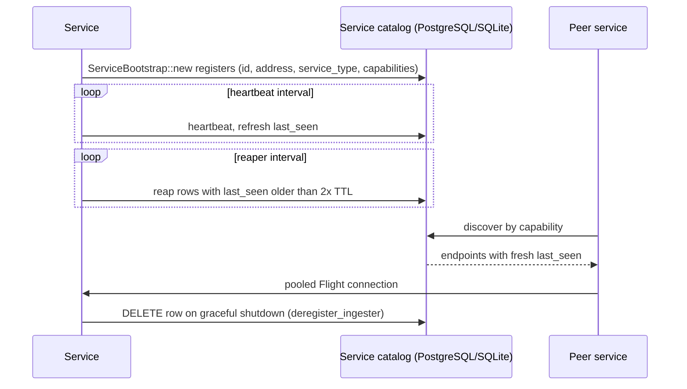

# Service Discovery Design

## Context

- In a microservice deployment, components (acceptor, writer, router, querier, etc.) must locate one another dynamically
- In monolithic mode services are co-located and discovery is handled internally
- SignalDB uses a catalog-based discovery mechanism with PostgreSQL or SQLite backend

**Current Implementation Status**: Catalog-based discovery is fully implemented and is the primary service discovery mechanism.

## Goals

- ✅ **Achieved**: Decouple service endpoints behind well-known roles
- ✅ **Achieved**: Support dynamic registration, unregistration, and automatic health expiration
- ✅ **Achieved**: Minimize additional infrastructure by reusing existing systems
- ✅ **Achieved**: Provide client-side caching and notifications of topology changes

## Discovery Mechanism

### Catalog-based Discovery ✅ **Implemented**

**Purpose**: Authoritative service registry using database storage

**Implementation**:
- PostgreSQL or SQLite database stores service instances
- Services register on startup via `ServiceBootstrap::new()`, which registers the row and internally spawns the heartbeat task
- Periodic heartbeats maintain liveness via `last_seen` timestamp updates
- Other services query the catalog for active service endpoints, filtering out rows whose `last_seen` is older than the discovery TTL
- Graceful shutdown deletes the row (`deregister_ingester`); crashed services never deregister, so a background reaper (`reap_stale_ingesters`, issue #555) deletes rows whose heartbeat is 2x TTL stale

**Current Service Registry Schema** (PostgreSQL flavor; SQLite uses TEXT columns):
```sql
CREATE TABLE ingesters (
    id UUID PRIMARY KEY,
    address TEXT NOT NULL,
    last_seen TIMESTAMP WITH TIME ZONE NOT NULL,
    service_type TEXT NOT NULL,
    capabilities TEXT NOT NULL          -- comma-separated ServiceCapability list
);

CREATE TABLE shards (
    id INT PRIMARY KEY,
    start_range BIGINT NOT NULL,
    end_range BIGINT NOT NULL
);

CREATE TABLE shard_owners (
    shard_id INT NOT NULL,
    ingester_id UUID NOT NULL,
    PRIMARY KEY (shard_id, ingester_id)
);
```

## Service Roles and Discovery

| Service Role | Discovery Method | Registration | Status |
|-------------|------------------|--------------|--------|
| **acceptor** | Catalog | Database via `ServiceBootstrap` | ✅ Implemented |
| **writer** | Catalog | Database via `ServiceBootstrap` | ✅ Implemented |
| **router** | Catalog | Database via `ServiceBootstrap` | ✅ Implemented |
| **querier** | Catalog | Database via `ServiceBootstrap` | ✅ Implemented |
| **compactor** | Catalog | Database via `ServiceBootstrap` | ✅ Implemented |

## Registration Process ✅ **Current Implementation**



### 1. Service Startup
```rust
// Registers with the catalog, spawns the heartbeat task and the stale-row
// reaper internally. The service id is a generated UUID.
let bootstrap = ServiceBootstrap::new(config, ServiceType::Querier, address).await?;
```

### 2. Health Monitoring
- **Catalog**: Periodic heartbeat updates to `last_seen` column
- **TTL**: Consumers filter out rows whose `last_seen` is older than `[discovery].ttl` (`list_active_ingesters`)
- **Reaper**: Each service also runs `reap_stale_ingesters`, deleting rows whose `last_seen` is 2x TTL stale (crashed services never deregister themselves)

### 3. Graceful Shutdown
- **Catalog**: `bootstrap.shutdown()` deletes the row (`deregister_ingester`) and aborts the heartbeat and reaper tasks

## Discovery API ✅ **Implemented**

Current discovery functionality in `src/common/src/catalog.rs` and `src/common/src/service_bootstrap.rs`:

```rust
/// Service instance metadata
pub struct Ingester {
    pub id: Uuid,
    pub address: String,
    pub last_seen: DateTime<Utc>,
    pub service_type: ServiceType,
    pub capabilities: Vec<ServiceCapability>,
}

/// Catalog-based discovery
impl Catalog {
    async fn register_ingester(
        &self,
        id: Uuid,
        address: &str,
        service_type: ServiceType,
        capabilities: &[ServiceCapability],
    ) -> Result<(), sqlx::Error>;
    async fn heartbeat(&self, id: Uuid) -> Result<(), sqlx::Error>;
    async fn list_ingesters(&self) -> Result<Vec<Ingester>, sqlx::Error>;
    async fn list_active_ingesters(&self, ttl: Duration) -> Result<Vec<Ingester>, sqlx::Error>;
    async fn discover_services_by_capability(
        &self,
        capability: ServiceCapability,
    ) -> Result<Vec<Ingester>, sqlx::Error>;
    async fn reap_stale_ingesters(&self, cutoff: DateTime<Utc>) -> Result<u64, sqlx::Error>;
    async fn deregister_ingester(&self, id: Uuid) -> Result<(), sqlx::Error>;
}

/// Service bootstrap: registration + heartbeat + reaper in one constructor.
/// There is no separate register() or start_heartbeat() method.
impl ServiceBootstrap {
    async fn new(config: Configuration, service_type: ServiceType, address: String) -> Result<Self>;
    async fn discover_services_by_capability(
        &self,
        capability: ServiceCapability,
    ) -> Result<Vec<Ingester>>;
    async fn shutdown(self) -> Result<()>;
}
```

### Service Capabilities

`ServiceCapability` (`src/common/src/flight/transport.rs`) has six variants:

| Capability | Registered by default by |
|------------|--------------------------|
| `TraceIngestion` | Acceptor, Writer |
| `Storage` | Writer |
| `Routing` | Router |
| `QueryExecution` | Querier |
| `StorageMaintenance` | Compactor |
| `KafkaIngestion` | (defined, not registered by any service today) |

## Configuration ✅ **Current Options**

### Catalog Configuration
```toml
[database]
dsn = "sqlite://.data/signaldb.db"   # or PostgreSQL DSN

[discovery]
dsn = "sqlite://.data/signaldb.db"   # Falls back to [database].dsn when [discovery] is absent
heartbeat_interval = "30s"
poll_interval = "60s"
ttl = "300s"
```

There is no `[service]` config section: the service address is passed programmatically to `ServiceBootstrap::new()`, and the service id is a generated UUID.

## Integration Patterns

### 1. Monolithic Mode ✅ **Working**
- All services in single process
- Discovery via shared catalog instance
- No network-based discovery needed

### 2. Microservices Mode ✅ **Working**  
- Each service deployed independently
- Discovery via shared catalog database
- Dynamic endpoint resolution

### 3. Hybrid Mode ✅ **Supported**
- Some services co-located, others distributed
- Discovery handles both local and remote services
- Flexible deployment configurations

## Client-Side Discovery ✅ **Implemented**

Services discover dependencies via:

```rust
// Router discovers queriers by capability (staleness-filtered by TTL upstream)
let queriers = bootstrap
    .discover_services_by_capability(ServiceCapability::QueryExecution)
    .await?;

// Flight client connection to discovered service
let endpoint = format!("http://{}", querier.address);
let flight_client = FlightServiceClient::connect(endpoint).await?;
```

## Operational Considerations

### Security
- Catalog access controlled via database credentials
- Database connections support TLS encryption

### Performance  
- ✅ **Implemented**: Client-side caching of discovered services
- ✅ **Implemented**: Configurable heartbeat intervals
- ✅ **Implemented**: Graceful handling of service failures

### Reliability
- ✅ **Implemented**: Database-backed persistent service registry
- ✅ **Implemented**: Automatic cleanup of stale registrations via TTL
- ✅ **Implemented**: Health monitoring and failure detection

## Deployment Examples

### Monolithic Deployment
```bash
# Single binary with embedded discovery
cargo run --bin signaldb
```

### Microservices Deployment  
```bash
# Each service discovers others via catalog
cargo run --bin signaldb-acceptor
cargo run --bin signaldb-writer
cargo run --bin signaldb-router
cargo run --bin signaldb-querier
cargo run --bin signaldb-compactor
```

## Future Enhancements *(Planned)*

### Advanced Service Mesh Integration
- Support for service mesh discovery (Consul, etcd)
- Integration with Kubernetes service discovery
- DNS-based service resolution

### Enhanced Health Checking
- Application-level health checks beyond heartbeats
- Service dependency health propagation
- Circuit breaker patterns for failed services

### Multi-Region Support
- Cross-region service discovery
- Geographic proximity-based routing
- Disaster recovery and failover

## Integration Test Coverage

Service discovery is exercised by the `tests-integration/` suite: capability-based routing, shared-catalog coordination, end-to-end Flight communication, and WAL durability with discovery. Run with `cargo test -p tests-integration`.

## Current Status Summary

✅ **Production Ready Features**:
- **Database-backed service registration** with PostgreSQL/SQLite support
- **Capability-based service discovery** with automatic routing
- **ServiceBootstrap pattern** for seamless service registration
- **Flight transport integration** with connection pooling
- **Automatic heartbeat and health monitoring** with TTL-based cleanup
- **Graceful service registration/deregistration** with proper shutdown handling
- **Support for both monolithic and microservices deployment** patterns

🚀 **Performance Characteristics**:
- **Connection pooling** for Flight clients reducing connection overhead
- **Capability filtering** reducing unnecessary service queries

🔄 **Future Enhancements**:
- **Service mesh integration** (Consul, etcd, Kubernetes)
- **Advanced health checking** beyond heartbeats
- **Multi-region capabilities** with geographic routing
- **Load balancing strategies** beyond round-robin

The catalog-based discovery system with ServiceBootstrap pattern provides a database-backed foundation used by every deployment mode.