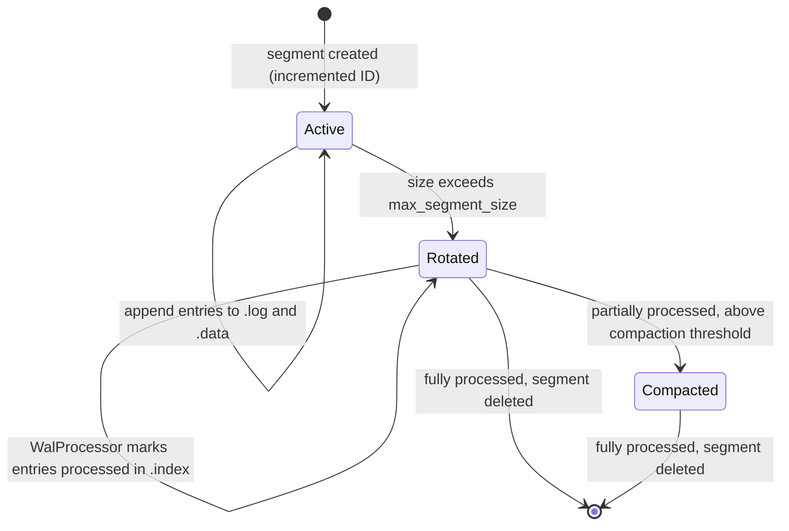

# Storage Layout Design

## Overview

SignalDB uses a three-tier storage model to balance durability, query performance, and operational flexibility:

```
┌─────────────────────────────────────────────────────────────────────┐
│                        Write-Ahead Log (WAL)                       │
│  Durability layer. Segmented files on local disk, per-tenant,      │
│  per-dataset, per-signal type. Data is buffered here before        │
│  being flushed to Iceberg tables.                                  │
└────────────────────────────┬────────────────────────────────────────┘
                             │ WalProcessor (background, 5s interval)
                             v
┌─────────────────────────────────────────────────────────────────────┐
│                      Iceberg SQL Catalog                           │
│  Metadata layer. SQLite-backed catalog named "signaldb" tracking   │
│  table schemas, snapshots, manifest lists, and partition specs.    │
│  Namespace = [tenant_slug, dataset_slug].                          │
└────────────────────────────┬────────────────────────────────────────┘
                             │ Table location pointers
                             v
┌─────────────────────────────────────────────────────────────────────┐
│                         Object Store                               │
│  Data layer. Parquet files + Iceberg metadata JSON files stored    │
│  in local filesystem, S3/MinIO, or in-memory backends.             │
│  Path = {base}/{tenant_slug}/{dataset_slug}/{table_name}/          │
└─────────────────────────────────────────────────────────────────────┘
```

## Object Store Layout

### Physical Directory Structure

All persistent data (Parquet files and Iceberg metadata) is stored in the object store configured via `[storage].dsn`. The path structure is:

```
{storage_base}/
  {tenant_slug}/
    {dataset_slug}/
      {table_name}/
        metadata/
          v1.metadata.json          # Iceberg table metadata
          snap-{id}.avro            # Manifest lists
          {uuid}-m0.avro            # Manifest files
        data/
          {uuid}.parquet            # Data files
```

### Concrete Example

With `dsn = "file:///.data/storage"`, tenant "acme" (slug `acme`), datasets "production" (slug `prod`) and "archive" (slug `archive`):

```
.data/storage/
  acme/
    prod/
      traces/
        metadata/
          v1.metadata.json
        data/
          00000-0-{uuid}.parquet
      logs/
        metadata/
        data/
      metrics_gauge/
        metadata/
        data/
      metrics_sum/
        metadata/
        data/
      metrics_histogram/
        metadata/
        data/
    archive/
      traces/
        metadata/
        data/
  beta/
    staging/
      traces/
        metadata/
        data/
```

### Storage Backends

The `[storage].dsn` config accepts three URL schemes:

| Scheme      | Backend          | Example                 | Notes                                                        |
| ----------- | ---------------- | ----------------------- | ------------------------------------------------------------ |
| `file://`   | Local filesystem | `file:///.data/storage` | `LocalFileSystem` with prefix                                |
| `memory://` | In-memory        | `memory://`             | For testing only; data lost on restart                       |
| `s3://`     | S3-compatible    | `s3://bucket/prefix`    | AWS S3, MinIO, or compatible. Uses env vars for credentials. |

**Path resolution** (`storage_dsn_to_path()` in `src/common/src/storage.rs`):

- `file:///.data/storage` -> `.data/storage` (strips leading `/.` for relative paths, resolved against the working directory)
- `file:///tmp/data` -> `/tmp/data` (keeps absolute paths)
- `s3://bucket/prefix` -> kept as-is

`file://` storage directories are created automatically at startup (`ensure_file_dsn_dir()` in `src/common/src/storage.rs`), so a missing directory on a fresh checkout is not an error.

### Per-Dataset Storage Override

Each dataset can optionally specify its own storage backend, enabling scenarios like:

- Production data on local NVMe for low latency
- Archive data on S3 for cost efficiency
- Test data in memory

```toml
[[auth.tenants]]
id = "acme"
slug = "acme"

[[auth.tenants.datasets]]
id = "production"
slug = "prod"
# Uses global [storage].dsn (no override)

[[auth.tenants.datasets]]
id = "archive"
slug = "archive"
[auth.tenants.datasets.storage]
dsn = "s3://acme-archive/signals"    # Per-dataset override
```

The resolution chain in `Configuration::get_dataset_storage_config()` (`src/common/src/config/mod.rs`):

1. Check `dataset.storage` -- if `Some`, use it
2. Fall back to global `config.storage`

The Querier registers per-dataset object stores with DataFusion's runtime environment so it can read Parquet files from whichever backend each dataset uses.

## Iceberg Catalog

### Catalog Configuration

The Iceberg metadata catalog is a SQLite-backed `SqlCatalog` (from `iceberg-sql-catalog`) named `"signaldb"`. It is configured via:

```toml
[schema]
catalog_type = "sql"
catalog_uri = "sqlite::memory:"          # In-memory (default, for dev/testing)
# catalog_uri = "sqlite:///.data/catalog.db"  # Persistent (recommended for production)
```

> **Limitation**: Only SQLite is supported for the Iceberg catalog. PostgreSQL URIs are rejected. This is distinct from the service discovery catalog which supports both SQLite and PostgreSQL.

Every connection the Iceberg catalog's pool opens gets three pragmas, set in two places:

| Pragma                 | Set by                                                                        | Why                                                                                                                                                                                                                                                                                      |
| ---------------------- | ----------------------------------------------------------------------------- | ---------------------------------------------------------------------------------------------------------------------------------------------------------------------------------------------------------------------------------------------------------------------------------------- |
| `journal_mode = wal`   | the catalog itself ([#381](https://github.com/JanKaul/iceberg-rust/pull/381)) | WAL lets readers proceed during a write and makes each write cheaper, so concurrent trace/log commits don't serialize behind an exclusive rollback-journal lock and stall first-time table creation. Adds `-wal`/`-shm` sidecars next to `catalog.db`; a no-op on an in-memory database. |
| `busy_timeout = 30000` | the catalog itself ([#381](https://github.com/JanKaul/iceberg-rust/pull/381)) | sqlx's 5s default is short enough that a commit contending with a compaction gives up while the lock is still moving.                                                                                                                                                                    |
| `synchronous = normal` | SignalDB, via `sqlite_session_statements` (`src/common/src/iceberg/mod.rs`)   | Under WAL this skips an fsync per commit while staying crash-safe.                                                                                                                                                                                                                       |

Together these match what the service discovery catalog (`src/common/src/catalog.rs`) sets. Pragmas cannot be carried on the DSN — sqlx's SQLite URL parser rejects them as query parameters — so they have to be set on the connection; SignalDB reaches them through the catalog's session-statement support ([#386](https://github.com/JanKaul/iceberg-rust/pull/386), currently a fork pin). Session statements run _after_ the catalog's own, so SignalDB could override a default if it ever needed to; today it only adds.

The pool connects lazily, so the pragmas are applied on first use rather than at construction. Nothing touches the database in between.

### Metadata retention

Every Iceberg commit writes a new `metadata.json`. To stop these accumulating without bound under continuous ingestion, SignalDB sets two properties on every table (`src/common/src/iceberg/table_manager.rs`):

- `write.metadata.previous-versions-max` — retain a bounded window of previous metadata files (default 100, configurable via `[writer].metadata_previous_versions_max`).
- `write.metadata.delete-after-commit.enabled = true` — delete metadata files aged out of that window on each commit.

The properties are applied at table creation, and `ensure_table` backfills any that are absent when it loads a pre-existing table (#959: tables created before the properties existed never pruned, so metadata accumulated forever). The backfill only adds missing keys — operator-set values are never overwritten — so it commits at most once per table; a commit lost to a concurrent-writer race is logged and retried on the next load. Note the backfill bounds growth going forward only: metadata files that already aged out of the metadata-log before the backfill are orphaned and need a one-time cleanup.

These are honored by the SQL catalog's delete-after-commit support (contributed upstream as [JanKaul/iceberg-rust#382](https://github.com/JanKaul/iceberg-rust/pull/382); SignalDB is temporarily pinned to a fork commit carrying it — see the note in `Cargo.toml`). This is safe because SignalDB queries only current snapshots (no metadata time-travel), and snapshot history is separately bounded by the compactor's snapshot expiration.

### Output file size

The Parquet writer rolls to a new data file when the file it is building reaches `write.target-file-size-bytes`, measured as **real encoded bytes** — what it has already flushed plus the row group still in hand — rather than an in-memory estimate. Decoded and encoded sizes diverge by roughly 5–10×, so rolling on a memory estimate produces files far under target.

SignalDB does not set this property at table creation. Compaction reconciles it instead, immediately before each rewrite: if the table's value differs from `[compactor].target_file_size_mb`, a metadata-only `update_properties` commit sets it (`common::iceberg::table_manager::ensure_target_file_size_property`). Setting it once at creation would be simpler but would drift the moment an operator changed the config — and a planner that treats files below `target_file_size_mb` as compaction inputs, paired with a writer rolling at some older value, never converges: it would re-select the same partition forever. Reconciling from the compaction path keeps the two definitions of "target" the same number by construction. The commit is a no-op once the value matches, and a commit lost to a concurrent-writer race is logged, not fatal — that cycle's output rolls at the table's previous target and the next cycle retries.

Left unset — on a table no compaction has touched yet — the writer falls back to its own 512 MiB default, which no ingest flush approaches, so ingest files are unaffected either way.

### Column statistics

Iceberg stores each column's value counts and min/max bounds inline in the **manifest entry of every data file**, so a bound is a per-file cost paid on every query plan, forever. Two controls keep that cost proportionate:

- **`truncate(16)` by default.** Bounds are shortened to 16 characters rather than stored at full length. A lower bound truncates to a prefix; an upper bound truncates and is then incremented so it still covers every value it bounds — and is dropped outright if it cannot be incremented, since an understated upper bound would prune files that hold matching rows. This is the Iceberg default and needs no property; iceberg-rust previously stored untruncated bounds for every column.
- **`counts` for free-text columns.** `body`, `status_message` and `exemplars` get `write.metadata.metrics.column.<col> = "counts"` at table creation (`common::schema::metrics_properties_for_free_text_columns`): counts are kept for the planner's cardinality estimates, bounds are dropped. No query compares these columns by range — `body` and `status_message` are matched by substring or regex, `exemplars` is a JSON blob read whole — so their bounds could never prune anything.

Attribute columns (`resource_attributes`, `scope_attributes`, `attributes`) are `map<string,string>`, and `attr_tokens` is a list, so neither carries bounds regardless. `trace_id`/`span_id` keep the truncated default; their bounds effectively never prune (a file's random-id range spans nearly the whole space) but the Parquet bloom filters described below do that work.

Honored by [JanKaul/iceberg-rust#385](https://github.com/JanKaul/iceberg-rust/pull/385).

### Namespace Structure

Iceberg namespaces use a two-level hierarchy based on **slugs**:

```
Namespace: [tenant_slug, dataset_slug]
Table:     table_name
Full:      Identifier([tenant_slug, dataset_slug], table_name)
```

Examples:

| Tenant | Dataset | Table         | Iceberg Identifier                                 |
| ------ | ------- | ------------- | -------------------------------------------------- |
| acme   | prod    | traces        | `Identifier(["acme", "prod"], "traces")`           |
| acme   | archive | logs          | `Identifier(["acme", "archive"], "logs")`          |
| beta   | staging | metrics_gauge | `Identifier(["beta", "staging"], "metrics_gauge")` |

Namespaces are created explicitly: `IcebergTableManager::ensure_table()` (`src/common/src/iceberg/table_manager.rs`) calls `create_namespace` before creating a table, treating "already exists" errors from concurrent creators as success.

### CatalogManager

`CatalogManager` (`src/common/src/catalog_manager.rs`) is the centralized singleton that holds the shared Iceberg catalog instance. All services (Writer, Querier, Router in monolithic mode) use the same `CatalogManager` to ensure consistent metadata access.

```rust
pub struct CatalogManager {
    catalog: Arc<dyn IcebergCatalog>,
    config: Configuration,
    table_manager: IcebergTableManager,
}
```

Key methods:

- `catalog()` -- returns `Arc<dyn IcebergCatalog>` for direct Iceberg operations
- `ensure_table(tenant_id, dataset_id, table_name)` -- resolves slugs and delegates to `IcebergTableManager::ensure_table()`
- `get_tenant_slug(tenant_id)` -- resolves slug from config (falls back to tenant_id)
- `get_dataset_slug(tenant_id, dataset_id)` -- resolves slug from config (falls back to dataset_id)
- `get_dataset_storage_config(tenant_id, dataset_id)` -- resolves per-dataset or global storage config
- `list_active_tenants()` / `resolve_tenant_by_slug(slug)` -- the tenant registry: config-defined tenants unioned with database (admin-API) ones, as source-agnostic `ResolvedTenant` descriptors

#### Resolved dataset invariant

A tenant's `default_dataset` is always present in its resolved `datasets`, whether or not a `datasets` row names it. The synthesized entry derives its slug and storage DSN the same way a runtime-added dataset does, so it is indistinguishable downstream.

Every write path now materializes that row — admin and management tenant creation, tenant update, and config sync all go through `upsert_tenant_with_default_dataset` or `ensure_dataset` — so a row-less default is a **legacy state**, carried by tenants created before that and cleared by `Catalog::backfill_default_datasets` at router/monolith boot. The invariant is what keeps such a tenant correct in the window before the backfill runs, and it costs nothing once converged.

This matters because every consumer that enumerates datasets -- compaction planning, retention enforcement, orphan cleanup, table reconciliation -- iterates that list. Without the invariant such a tenant resolves with no datasets and is skipped silently, with no error and no warning.

### DataFusion Integration

The Querier (`src/querier/src/flight.rs`) wraps the Iceberg catalog with a `TenantCatalog` to bridge DataFusion's 3-level naming model to Iceberg's 2-level namespace:

```
DataFusion:   SELECT * FROM acme.prod.traces
                            ^^^^  ^^^^  ^^^^^^
                          catalog schema table

Iceberg:      Identifier(["acme", "prod"], "traces")
                          ^^^^^^^^^^^^^^^   ^^^^^^
                            namespace       table
```

`TenantCatalog` implements `CatalogProvider`:

- `schema_names()`: Filters Iceberg namespaces to those starting with `{tenant_slug}.`, strips the prefix
- `schema(name)`: Prepends `{tenant_slug}.` to look up the full namespace `{tenant_slug}.{dataset_slug}`

At startup, the Querier registers a `TenantCatalog` per enabled tenant, named by the tenant's slug.

## Table Types

SignalDB creates up to 8 table types per tenant-dataset combination, controlled by the `[schema.default_schemas]` config (resolved per tenant, so a tenant override narrows the set).

Tables reach a dataset two ways, both through the same load-or-create `CatalogManager::ensure_table`:

- **Provisioned ahead of ingest** by the writer's reconciler (`src/writer/src/reconcile.rs`) — a pass at startup and one every `[writer].table_reconcile_interval` over the tenant registry, so a dataset holds its enabled tables (empty, no snapshot) from the moment it is registered. See [Signal table provisioning](../operations/table-provisioning.md).
- **On first write**, as before, when the writer's `IcebergTableWriter` opens a table the reconciler has not reached yet.

Because both paths call the same constructor, a provisioned table is indistinguishable from one a first write created, and a failing reconciler degrades to create-on-first-write.

### Signal Type to Table Mapping

| Signal Type              | Table Name                      | WalOperation    | Schema Source                    |
| ------------------------ | ------------------------------- | --------------- | -------------------------------- |
| Traces                   | `traces`                        | `WriteTraces`   | `schemas.toml` (v2, inherits v1) |
| Logs                     | `logs`                          | `WriteLogs`     | `schemas.toml` (v1)              |
| Metrics (Gauge)          | `metrics_gauge`                 | `WriteMetrics`  | `schemas.toml` (v1)              |
| Metrics (Sum)            | `metrics_sum`                   | `WriteMetrics`  | `schemas.toml` (v1)              |
| Metrics (Histogram)      | `metrics_histogram`             | `WriteMetrics`  | `schemas.toml` (v1)              |
| Metrics (Exp. Histogram) | `metrics_exponential_histogram` | `WriteMetrics`  | `schemas.toml` (v1)              |
| Metrics (Summary)        | `metrics_summary`               | `WriteMetrics`  | `schemas.toml` (v1)              |
| Profiles                 | `profiles`                      | `WriteProfiles` | `schemas.toml` (v1)              |

For metrics, the target table name is extracted from the WAL entry's `metadata` JSON field (`target_table`), defaulting to `metrics_gauge`.

### Partitioning

All tables are partitioned by **hour** using Iceberg's built-in `Hour` transform on the `timestamp` column:

```
PartitionField {
    source_id: <timestamp field id>,
    field_id: 1000 + <timestamp field id>,
    name: "timestamp_hour",
    transform: Transform::Hour,
}
```

Hour-level partitioning automatically enables day/month/year pruning in DataFusion queries.

### Declared sort order

Every signal table also declares an Iceberg **sort order** in its table
metadata, under order id `1` (Iceberg reserves order id `0` for "unsorted").
The key is time-leading for every signal, matching both the hour partitioning
and the dominant query shape, "filter a time range, order by time, take the
most recent _n_":

| Table                  | Sort key                                     |
| ---------------------- | -------------------------------------------- |
| `traces`               | `timestamp`, `trace_id`                      |
| `logs`                 | `timestamp`, `service_name`, `severity_text` |
| `metrics_*` (all five) | `timestamp`, `metric_name`, `service_name`   |
| `profiles`             | `timestamp`, `service_name`                  |

All columns are ascending with nulls first. `TableSchema::sort_key_columns()`
in `iceberg/schemas.rs` is the single source of truth: producers sort by it,
and it is the only ordering the query engine is ever told about. Sort fields
are bound to the field ids of the schema they are declared against, because
materialized-label columns shift those ids from tenant to tenant.

The declaration is table-level **intent**. Whether a given file honors it is a
per-file fact, recorded in the file itself: a producer that sorts its rows
writes Parquet row-group `sorting_columns` plus an `iceberg.sort-order-id`
footer entry, which becomes the `sort_order_id` on the file's manifest entry.
The DataFusion provider claims the declared ordering only for files carrying
that attestation, so a table holding any unattested file keeps its explicit
sort and results stay correct. Files written before the table declared an
order are simply unattested; compaction converges them as it rewrites
partitions. There is no backfill job.

The invariant the whole arrangement rests on: **a file may only be attested if
its rows really are sorted by the declared key.** Attesting a file that is not
sorted does not make queries slower, it makes them wrong — the engine drops a
sort it believed was redundant. A code path that cannot guarantee the order
must write its files unattested.

#### What each producer does

Both producers resolve the key through one shared decision,
`common::iceberg::sort::write_sort_key`, so they cannot drift on what "the
declared order" means or on when a file may claim it:

- **Ingest** (`writer/src/storage/iceberg.rs`) concatenates each commit group
  and sorts it once — columnar, one `lexsort_to_indices` pass plus a `take` —
  before writing. The group is sorted as a whole rather than per batch,
  because files are rolled from the stream in order, so a file can only be
  sorted if the stream is. Debug builds re-derive the permutation afterwards
  and assert it is the identity, so a build that gets the sort wrong fails
  loudly in tests instead of shipping a false claim.
- **Compaction** (`compactor/src/rewriter.rs`) already sorted its output; it
  now takes the key from the table's declaration instead of a list of its own,
  and attests the files it writes. Its output is a stream, so there is no
  equivalent cheap self-check — verifying it would mean checking every batch
  and every batch boundary.

The two deliberately differ on one case: **a table that declares no order
yet.** Ingest leaves such a write unsorted (nothing could attest it, so the
sort would cost the write path and buy the reader nothing); compaction still
sorts by the canonical key, because it has always laid partitions out sorted
and dropping that would regress the layout. Neither attests. The asymmetry is
expressed as an `UndeclaredFallback` argument at the two call sites rather
than as two independently maintained branches — it is intentional, not drift.
Sorted-but-unattested output must stay unattested: attribution is a claim
about the table's _declared_ order, and there is none to claim.

For the operator's view of all this — what changes on upgrade, how to check a
plan, and how to switch the behavior off — see
[Ordered queries and sort-order attestation](../operations/query-ordering.md).

### Table Schemas

`schemas.toml` (compiled into the binary via `include_str!`) is the physical
schema source of truth for all six built-in table types — traces, logs, and
all five metrics representations plus profiles — resolved with versioning
and inheritance via `SchemaDefinitions`/`ResolvedSchema`
(`src/common/src/schema/schema_parser.rs`). `src/common/src/iceberg/schemas.rs`'s
`create_*_schema_with()` functions are thin wrappers around that resolution
(`ResolvedSchema::to_iceberg_schema_with_labels`), not hand-built field
lists — metrics/profiles only gained this in the same change that added
their `schemas.toml` sections; before that, only traces/logs resolved from
TOML and metrics/profiles were hand-written Rust.

#### Traces Table (v2 -- current)

Defined in `schemas.toml` via v1 base + v2 inheritance with renames and additions.

| #   | Field                  | Iceberg Type | Required | Notes                                                |
| --- | ---------------------- | ------------ | -------- | ---------------------------------------------------- |
| 1   | `trace_id`             | String       | Yes      |                                                      |
| 2   | `span_id`              | String       | Yes      |                                                      |
| 3   | `parent_span_id`       | String       | No       |                                                      |
| 4   | `span_name`            | String       | Yes      | Renamed from `name` in v2                            |
| 5   | `service_name`         | String       | Yes      |                                                      |
| 6   | `start_time_unix_nano` | Long         | Yes      | Nanoseconds since epoch                              |
| 7   | `end_time_unix_nano`   | Long         | Yes      | Nanoseconds since epoch                              |
| 8   | `duration_nanos`       | Long         | Yes      | Renamed from `duration_nano` in v2                   |
| 9   | `span_kind`            | String       | Yes      |                                                      |
| 10  | `status_code`          | String       | Yes      |                                                      |
| 11  | `status_message`       | String       | No       |                                                      |
| 12  | `is_root`              | Boolean      | Yes      |                                                      |
| 13  | `span_attributes`      | String       | No       | JSON. Renamed from `attributes_json` in v2           |
| 14  | `resource_attributes`  | String       | No       | JSON. Renamed from `resource_json` in v2             |
| 15  | `events`               | String       | No       | JSON serialized (nested List<Struct> in Flight)      |
| 16  | `links`                | String       | No       | JSON serialized (nested List<Struct> in Flight)      |
| 17  | `trace_state`          | String       | No       |                                                      |
| 18  | `resource_schema_url`  | String       | No       |                                                      |
| 19  | `scope_name`           | String       | No       |                                                      |
| 20  | `scope_version`        | String       | No       |                                                      |
| 21  | `scope_schema_url`     | String       | No       |                                                      |
| 22  | `scope_attributes`     | String       | No       |                                                      |
| 23  | `timestamp`            | Timestamp    | Yes      | Computed from `start_time_unix_nano`. Partition key. |
| 24  | `date_day`             | Date         | Yes      | Computed from timestamp                              |
| 25  | `hour`                 | Int          | Yes      | Computed from timestamp                              |

**Partition**: `Hour(timestamp)` as `timestamp_hour`

#### Logs Table (v1 -- current)

Defined in `schemas.toml`.

| #   | Field                 | Iceberg Type       | Required | Notes                                  |
| --- | --------------------- | ------------------ | -------- | -------------------------------------- |
| 1   | `timestamp`           | Timestamp          | Yes      | Partition key                          |
| 2   | `observed_timestamp`  | Timestamp          | No       |                                        |
| 3   | `trace_id`            | String             | No       | Correlation with traces                |
| 4   | `span_id`             | String             | No       | Correlation with traces                |
| 5   | `trace_flags`         | Int                | No       |                                        |
| 6   | `severity_text`       | String             | No       |                                        |
| 7   | `severity_number`     | Int                | No       |                                        |
| 8   | `service_name`        | String             | Yes      |                                        |
| 9   | `body`                | String             | No       |                                        |
| 10  | `resource_schema_url` | String             | No       |                                        |
| 11  | `resource_attributes` | Map<String,String> | No       | typed map (legacy tables: JSON string) |
| 12  | `scope_schema_url`    | String             | No       |                                        |
| 13  | `scope_name`          | String             | No       |                                        |
| 14  | `scope_version`       | String             | No       |                                        |
| 15  | `scope_attributes`    | Map<String,String> | No       | typed map (legacy tables: JSON string) |
| 16  | `log_attributes`      | Map<String,String> | No       | typed map (legacy tables: JSON string) |
| 17  | `date_day`            | Date               | Yes      | Computed from timestamp                |
| 18  | `hour`                | Int                | Yes      | Computed from timestamp                |

**Partition**: `Hour(timestamp)` as `timestamp_hour`

### Materialized labels

By default every attribute other than the promoted columns above lives in
the `*_attributes` JSON and is queried by a substring match — inexact and
limited to `=` / `!=`. Configuring `[schema.materialized_labels]` promotes
chosen attribute keys into dedicated columns so they can be matched exactly,
by regex, and with ordered comparisons.

```toml
[schema.materialized_labels]
logs = ["namespace", "pod"]
# traces = [...]   # metrics / profiles likewise

# Per-tenant override: replaces the global set wholesale for that tenant
[auth.tenants.schema.materialized_labels]
logs = ["team", "region"]
```

- **Column naming**: a label key `k` becomes a nullable string column
  `label_<k>` with non-alphanumeric characters replaced by `_` (so
  `http.method` → `label_http_method`). This is the one mapping used by
  schema generation, the writer, and the querier.
- **Population** (writer): each row's value is taken from its **resource**,
  then **scope**, then **record** attributes (first non-null wins); the value
  is also left in the attribute JSON, so label discovery is unaffected.
- **Per-tenant resolution**: allowlists resolve per tenant — a tenant
  schema override replaces the global set wholesale (no merging) — both
  where tables are created (`CatalogManager::ensure_table`) and in the
  writer's transforms.
- **When it applies**: a table carries the columns from its configured set at
  creation time — whether provisioning or a first write created it; existing tables can gain further
  `label_<key>` columns post-creation through
  [schema evolution](#label-columns-can-be-added-to-existing-tables). A table
  that predates a label (and has not been evolved) keeps matching it through
  the JSON substring path;
  the writer's schema coercion drops columns a table lacks and null-fills
  nullable columns it has but the current config no longer produces.
- **Querying**: the querier routes a label to its `label_<key>` column when
  the table has one, else to the JSON match (see the
  [LogQL reference](../users/logql-reference.md#materialized-labels)).

The same mechanism applies across all four signals:

- **logs** — LogQL matches materialized labels exactly, with regex and
  ordered comparisons;
- **traces** — the Tempo search API (`tags` / TraceQL attribute selectors)
  matches them exactly;
- **metrics** — PromQL label matchers (`metric{key="v"}`) match exactly and
  by regex on the column; `by (key)` / `without (key)` group on it, and the
  label is part of each series' natural identity (bare selectors and
  `rate()` emit one series per label combination);
- **profiles** — the columns are populated for consistency; the Pyroscope
  query surface filters only by `service_name` / sample type today.

Each signal's writer transform extracts the label from that signal's
attribute JSON (metrics per exploded data point); the querier routes to the
column when the queried table has it, else the JSON substring match.

### Parquet bloom filters

For **point lookups on high-cardinality columns**, Parquet row-group min/max
statistics are useless: every time-ordered data file spans the full random
value range, so `min ≤ target ≤ max` always holds and no file can be skipped.
The only structure that prunes a random point lookup is a per-column **bloom
filter**.

SignalDB enables them by writing the standard Iceberg table property
`write.parquet.bloom-filter-enabled.column.<col> = "true"` at table creation;
the pinned iceberg-rust Parquet writer honors it on every write, so both
ingest and compaction output carry the filters. The per-table-type dispatch
lives in `common::schema::bloom_filter_properties_for_table`. Enabled
columns:

- **traces and logs** — `trace_id` and `span_id` (single-trace / single-span
  lookups on traces; logs-for-a-trace correlation on logs, where the columns
  are optional but named identically). Set via
  `common::schema::bloom_filter_properties_for_trace_columns`.
- **logs** — additionally the derived `attr_tokens` list leaf (`key=value`
  containment).
- **all signals** — every materialized `label_<key>` column.

The `trace_id`/`span_id` columns additionally carry
`write.parquet.bloom-filter-fpp.column.<col> = "0.01"`. A filter is sized from
its target false-positive probability, and Parquet's `0.05` default means one
row group in twenty is read for nothing — for a single-trace lookup, that
wasted read _is_ the query. `0.01` cuts it five-fold for a filter roughly 40%
larger.

`trace_id` additionally carries
`write.parquet.bloom-filter-ndv.column.trace_id`, sizing the filter from an
estimated distinct-value count rather than parquet-rs's default (which
assumes one distinct value per row in a full row group — correct for
`span_id`, unique per row, but an overestimate for `trace_id`, which repeats
across every span of a trace). `span_id` leaves ndv unset since the default
already fits it. See `common::schema::BLOOM_FILTER_TRACE_ID_NDV` for the
estimate and its caveats.

### Parquet compression

Every table records `write.parquet.compression-codec = "zstd"` and
`write.parquet.compression-level = "1"`
(`common::schema::compression_properties`). Level 1 is what files have always
been written at; iceberg-rust's `CreateTableBuilder` recorded level 3 in table
metadata while the writer hardcoded level 1, so the metadata described a file
that was never written. Now that the writer honors these properties
([JanKaul/iceberg-rust#387](https://github.com/JanKaul/iceberg-rust/pull/387)),
pinning the level keeps the bytes identical and makes the metadata true.
Raising it trades ingest CPU for storage and is worth measuring rather than
inheriting by accident.

The properties are metadata set at **creation time**: a table created before a
column was added to the enabled set does not gain the filter retroactively
(compaction rewrites inherit whatever the table metadata currently declares).

On the read path the filters are consulted automatically. `datafusion_iceberg`
reports `Inexact` filter pushdown and builds its scan without a predicate, but
DataFusion's physical filter-pushdown injects the query predicate into the
`DataSourceExec`, and with `datafusion.execution.parquet.bloom_filter_on_read`
defaulting on, a bloom-filtered file skips row groups that cannot contain the
target. See `tests-integration/tests/querier/trace_bloom_pruning.rs`.

#### Metrics Gauge Table (v1 -- current)

Defined in `src/common/src/iceberg/schemas.rs`.

| #   | Field                      | Iceberg Type       | Required | Notes                           |
| --- | -------------------------- | ------------------ | -------- | ------------------------------- |
| 1   | `timestamp`                | Timestamp          | Yes      | Partition key                   |
| 2   | `start_timestamp`          | Timestamp          | No       |                                 |
| 3   | `service_name`             | String             | Yes      |                                 |
| 4   | `metric_name`              | String             | Yes      |                                 |
| 5   | `metric_description`       | String             | No       |                                 |
| 6   | `metric_unit`              | String             | No       |                                 |
| 7   | `value`                    | Double             | Yes      |                                 |
| 8   | `flags`                    | Int                | No       |                                 |
| 9   | `resource_schema_url`      | String             | No       |                                 |
| 10  | `resource_attributes`      | String             | No       | JSON                            |
| 11  | `scope_name`               | String             | No       |                                 |
| 12  | `scope_version`            | String             | No       |                                 |
| 13  | `scope_schema_url`         | String             | No       |                                 |
| 14  | `scope_attributes`         | String             | No       | JSON                            |
| 15  | `scope_dropped_attr_count` | Int                | No       |                                 |
| 16  | `attributes`               | Map<String,String> | No       | typed map (legacy: JSON string) |
| 17  | `exemplars`                | String             | No       | JSON                            |
| 18  | `date_day`                 | Date               | Yes      | Computed                        |
| 19  | `hour`                     | Int                | Yes      | Computed                        |

**Partition**: `Hour(timestamp)` as `timestamp_hour`

#### Metrics Sum Table (v1 -- current)

Extends Gauge with aggregation fields.

| #     | Field                     | Iceberg Type | Required | Notes                                |
| ----- | ------------------------- | ------------ | -------- | ------------------------------------ |
| 1-8   | _(same as Gauge 1-8)_     |              |          |                                      |
| 9     | `aggregation_temporality` | Int          | Yes      | 0=Unspecified, 1=Delta, 2=Cumulative |
| 10    | `is_monotonic`            | Boolean      | Yes      |                                      |
| 11-21 | _(same as Gauge 9-19)_    |              |          |                                      |

**Partition**: `Hour(timestamp)` as `timestamp_hour`

#### Metrics Histogram Table (v1 -- current)

| #     | Field                                                 | Iceberg Type | Required | Notes       |
| ----- | ----------------------------------------------------- | ------------ | -------- | ----------- |
| 1-6   | _(same as Gauge 1-6)_                                 |              |          |             |
| 7     | `count`                                               | Long         | Yes      | Total count |
| 8     | `sum`                                                 | Double       | No       |             |
| 9     | `min`                                                 | Double       | No       |             |
| 10    | `max`                                                 | Double       | No       |             |
| 11    | `bucket_counts`                                       | String       | No       | JSON array  |
| 12    | `explicit_bounds`                                     | String       | No       | JSON array  |
| 13    | `flags`                                               | Int          | No       |             |
| 14    | `aggregation_temporality`                             | Int          | Yes      |             |
| 15-25 | _(resource/scope/attributes/exemplars/date_day/hour)_ |              |          |             |

**Partition**: `Hour(timestamp)` as `timestamp_hour`

#### Metrics Exponential Histogram Table (v1 -- current)

| #     | Field                                                 | Iceberg Type | Required | Notes      |
| ----- | ----------------------------------------------------- | ------------ | -------- | ---------- |
| 1-6   | _(same as Gauge 1-6)_                                 |              |          |            |
| 7     | `count`                                               | Long         | Yes      |            |
| 8     | `sum`                                                 | Double       | No       |            |
| 9     | `min`                                                 | Double       | No       |            |
| 10    | `max`                                                 | Double       | No       |            |
| 11    | `scale`                                               | Int          | No       |            |
| 12    | `zero_count`                                          | Long         | No       |            |
| 13    | `positive_offset`                                     | Int          | No       |            |
| 14    | `positive_bucket_counts`                              | String       | No       | JSON array |
| 15    | `negative_offset`                                     | Int          | No       |            |
| 16    | `negative_bucket_counts`                              | String       | No       | JSON array |
| 17    | `flags`                                               | Int          | No       |            |
| 18    | `aggregation_temporality`                             | Int          | Yes      |            |
| 19    | `zero_threshold`                                      | Double       | No       |            |
| 20-30 | _(resource/scope/attributes/exemplars/date_day/hour)_ |              |          |            |

**Partition**: `Hour(timestamp)` as `timestamp_hour`

#### Metrics Summary Table (v1 -- current)

| #     | Field                                                 | Iceberg Type | Required | Notes                                     |
| ----- | ----------------------------------------------------- | ------------ | -------- | ----------------------------------------- |
| 1-6   | _(same as Gauge 1-6)_                                 |              |          |                                           |
| 7     | `count`                                               | Long         | Yes      |                                           |
| 8     | `sum`                                                 | Double       | Yes      |                                           |
| 9     | `quantile_values`                                     | String       | No       | JSON array of `{quantile, value}` objects |
| 10    | `flags`                                               | Int          | No       |                                           |
| 11-21 | _(resource/scope/attributes/exemplars/date_day/hour)_ |              |          |                                           |

**Partition**: `Hour(timestamp)` as `timestamp_hour`

## WAL Layout

### Directory Structure

The WAL is organized by tenant, dataset, and signal type under the configured
base directory. Both WAL-owning services — the acceptor and the writer — hold
one `Wal` instance per `(tenant, dataset, signal)` behind a shared
`WalManager` (`src/common/src/wal/manager.rs`), created lazily on that
combination's first write. Isolation is the point: each instance has its own
segments, its own flush mutex, and its own dead-letter directory, so a
poisoned segment or a slow disk on one tenant neither blocks nor contaminates
another tenant's ingest path.

```
{wal_dir}/
  {tenant_id}/
    {dataset_id}/
      {signal_type}/
        wal-0000000000.log      # Entry metadata (framed, CRC-checked bincode WalEntry records)
        wal-0000000000.data     # Payloads (framed, CRC-checked Arrow IPC streams)
        wal-0000000000.index    # Processed entry tracking (UUID list)
        wal-0000000001.log      # Next segment after rotation
        wal-0000000001.data
        wal-0000000001.index
        dead-letter/             # Entries retired so they stop blocking (see below)
```

A segment rotates when **either** its `.log` or its `.data` file would exceed
`max_segment_size`. The `.data` file holds the payloads and grows much faster
than the metadata `.log`, so in practice rotation is driven by the data file —
this bounds each segment's size and keeps `.data` offsets well clear of the
4 GB (2³²) range. Within a segment, each entry's payload is written at the exact
offset recorded in its `.log` entry (the writer seeks to that offset rather than
blind-appending), so a short or partial write cannot shift the offsets of the
entries that follow it.

Replaying a segment's `.log` file on load can hit a record whose header is
intact but whose payload no longer matches its CRC or no longer deserializes
(a bit flip or partial overwrite from an OOM kill or disk fault). Because the
framing is intact, the offset of the next record is still known, so
`WalSegment::load` skips just that record — logging the failure, quarantining
its raw bytes to `dead-letter/segment-<id>-offset-<offset>.corrupt.bin`, and
resuming — rather than aborting the whole replay, which would otherwise turn
one corrupted record into a permanent crash loop on every restart. Every other
`dead-letter/` artifact is keyed by `<entry_id>`, taken from a
successfully-decoded `WalEntry`; this is the one kind keyed by its physical
`segment-<id>-offset-<offset>` location instead, because the entry id lives
inside the very bytes that failed to decode. A damaged `.data` record is caught
the same way on read (its record CRC fails), quarantined as
`dead-letter/<entry_id>.corrupt.bin`, and the entry retired without touching
its neighbours. See
[WAL Persistence](../operations/wal-persistence.md#corrupted-entry-records-during-replay)
for the full recovery behavior and the other `dead-letter/` artifact kinds.

### Concrete Example

The runtime `WalConfig` (`src/common/src/wal/mod.rs`) defaults to `wal_dir = ".wal"`, but the services derive their WAL directory from the `[wal].wal_dir` config value (default `.data/wal`) with a per-service suffix: the acceptor uses `{wal_dir}/acceptor` and the writer `{wal_dir}/writer`, overridable via `ACCEPTOR_WAL_DIR` / `WRITER_WAL_DIR`. Both services lay out the same tenant tree under their own service directory; the one shown below sits under the acceptor's, which with the defaults is `.data/wal/acceptor`:

```
.data/wal/
  acme/
    production/
      traces/
        wal-0000000000.log
        wal-0000000000.data
        wal-0000000000.index
      logs/
        wal-0000000000.log
        wal-0000000000.data
        wal-0000000000.index
      metrics/
        wal-0000000000.log
        wal-0000000000.data
        wal-0000000000.index
    staging/
      traces/
        ...
  beta/
    staging/
      traces/
        ...
```

### WAL Configuration

```rust
pub struct WalConfig {
    pub wal_dir: PathBuf,            // Default: ".wal"
    pub max_segment_size: u64,       // Default: 64 MB (67108864 bytes)
    pub max_buffer_entries: usize,   // Default: 1000
    pub flush_interval_secs: u64,    // Default: 30 seconds
    pub tenant_id: String,           // Required, non-empty
    pub dataset_id: String,          // Required, non-empty
    pub retention_secs: u64,         // Default: 3600 (keep processed entries 1 hour)
    pub cleanup_interval_secs: u64,  // Default: 300 (cleanup pass every 5 minutes)
    pub compaction_threshold: f64,   // Default: 0.5 (compact segment at 50% processed)
}
```

The WAL enforces non-empty `tenant_id` and `dataset_id` at construction time.

### Segment Files

Each WAL segment consists of three files:

| File     | Format                          | Content                                                                                                     |
| -------- | ------------------------------- | ----------------------------------------------------------------------------------------------------------- |
| `.log`   | Segment header + framed records | `SDBW` magic + u32 version, then `[u32 len][u32 crc32][bincode WalEntry]` per record                        |
| `.data`  | Framed records                  | `[SDBR magic][u32 len][u32 crc32][Arrow IPC stream]` per entry; entries address the record header by offset |
| `.index` | Binary                          | 8-byte count + 16-byte UUIDs of processed entries                                                           |

#### Record Framing (format v1)

Every record in both files is self-describing and checksummed
(`src/common/src/wal/framing.rs`), so corruption at rest is _attributable_
(the read names the entry, tenant, dataset, signal, and offset) and
_skippable_ (the reader steps over the one bad record and keeps serving its
neighbours) instead of surfacing as an opaque Arrow parse error that poisons
the whole segment.

```text
.log:  [ "SDBW" | u32 version=1 ]                          once, at offset 0
       [ u32 payload_len | u32 crc32(payload) | payload ]  per WalEntry record

.data: [ "SDBR" | u32 payload_len | u32 crc32(payload) | payload ]  per entry
```

All integers are little-endian; the checksum is CRC-32 (IEEE). A `WalEntry`'s
`data_offset` points at the `.data` record _header_ and its `data_size` is the
payload length (header excluded), so a read cross-checks the header's length
against the entry before trusting the checksum. Any mismatch — wrong magic,
length disagreement, or CRC failure — is reported as corruption of that one
entry.

**Legacy segments.** Segments written before format v1 have no segment
header and no record headers (`.log` = `[u64 len][bincode]`, `.data` = raw
payloads). They are recognised by the missing magic and handled without an
operator step: entries are read on the legacy layout, the segment is sealed
against new appends (the WAL rotates onto a fresh v1 segment on open, logging
a warning naming the legacy file), and compaction rewrites survivors into v1.
Once fully processed a legacy segment is deleted like any other. Nothing
converts a legacy segment in place.

### WAL Entry Structure

```rust
pub struct WalEntry {
    pub id: Uuid,
    pub timestamp: u64,
    pub operation: WalOperation,      // WriteTraces | WriteLogs | WriteMetrics | Flush
    pub data_size: u64,               // Payload length in .data file (record header excluded)
    pub data_offset: u64,             // Offset of the record header in .data file
    pub processed: bool,
    pub tenant_id: String,
    pub dataset_id: String,
    pub metadata: Option<String>,     // JSON with schema_version, signal_type, target_table, etc.
}
```

### Segment Lifecycle



1. **Write**: New entries appended to current segment's `.log` and `.data` files
2. **Rotation**: When segment exceeds `max_segment_size` (64MB default), a new segment is created with incremented ID
3. **Processing**: `WalProcessor` reads unprocessed entries, writes to Iceberg, marks entries in `.index`
4. **Cleanup**: Fully-processed segments are deleted. Partially-processed segments above compaction threshold are compacted.

### Data Serialization

Arrow RecordBatches are serialized to/from bytes using Arrow's IPC StreamWriter/StreamReader:

```rust
// Write
let mut writer = StreamWriter::try_new(&mut buffer, &batch.schema())?;
writer.write(batch)?;
writer.finish()?;

// Read
let reader = StreamReader::try_new(&data[offset..offset + size], None)?;
let batch = reader.into_iter().next().unwrap()?;
```

## Schema Versioning and Evolution

### Schema Definition System

Schemas are defined in `schemas.toml` at the repository root and compiled into the binary via `include_str!`. The system supports:

| Feature             | Description                                                                                        |
| ------------------- | -------------------------------------------------------------------------------------------------- |
| **Versioning**      | Each signal type tracks a current version (e.g., `current_trace_version = "v2"`)                   |
| **Inheritance**     | A version can inherit all fields from a parent: `inherits = "v1"`                                  |
| **Field renames**   | Rename fields across versions: `{ from = "name", to = "span_name" }`                               |
| **Field additions** | Add new fields: `{ name = "timestamp", type = "timestamp_ns", computed = "start_time_unix_nano" }` |
| **Computed fields** | Fields derived from other fields at write time                                                     |

### Schema Resolution

The `SchemaDefinitions` struct (`src/common/src/schema/schema_parser.rs`) resolves a versioned schema by:

1. Loading the base version's fields
2. If `inherits` is specified, recursively resolving the parent and starting with its fields
3. Applying `field_renames` to inherited fields
4. Appending `field_additions`

### Flight Schema vs Iceberg Schema

The Flight wire format (v1) and Iceberg storage format (v2) are intentionally different:

| Aspect           | Flight Schema (v1)            | Iceberg Schema (v2)             |
| ---------------- | ----------------------------- | ------------------------------- |
| Span name field  | `name`                        | `span_name`                     |
| Duration field   | `duration_nano` (UInt64)      | `duration_nanos` (Long/Int64)   |
| Attributes field | `attributes_json`             | `span_attributes`               |
| Resource field   | `resource_json`               | `resource_attributes`           |
| Time fields      | UInt64 (nanoseconds)          | Long/Int64 (nanoseconds)        |
| Events/Links     | `List<Struct>` (nested Arrow) | `String` (JSON serialized)      |
| Partition fields | None                          | `timestamp`, `date_day`, `hour` |

### Write-Time Transformation

The Writer applies `transform_trace_v1_to_v2()` (`src/writer/src/schema_transform.rs`) at ingestion time:

1. **Detection**: Checks if batch has `name` field (v1) or `span_name` field (v2)
2. **Field renames**: Maps v1 field names to v2 names
3. **Type conversions**: `UInt64` -> `Int64` for Iceberg compatibility
4. **Complex type serialization**: `List<Struct>` events/links -> JSON strings
5. **Computed fields**: Generates `timestamp`, `date_day`, `hour` from `start_time_unix_nano`

The transformation is applied in the Writer's Flight `do_put` handler before data is written to the WAL, ensuring all WAL data is in physical-v3 format (despite the function's name).

### Label columns can be added to existing tables

Existing tables can gain optional string `label_<key>` columns after creation via `add_label_columns()` (`src/common/src/iceberg/evolution.rs`). This is the evolution path used by attribute auto-promotion: the helper appends the columns to the current schema and commits `AddSchema` + `SetCurrentSchema` through `Catalog::update_table` — a metadata-only commit.

- **No data rewrite**: Parquet files written before the flip are never rewritten for it; readers null-fill the new columns for old files. The rewrite-coupled promotion backfills values at the next compaction.
- **Snapshot-pinned schemas remain reachable**: the previous schema stays in table metadata, so snapshots that pin it keep resolving.
- **Field ids** continue after the maximum id across the whole schema tree — including nested map key/value and list element ids — so new columns never collide with the attributes map's nested ids.
- **Idempotent**: keys whose materialized column already exists are skipped; when nothing new remains, no commit is made.
- **Verified**: the table is reloaded after the commit and the evolved schema checked, because the SQL catalog's compare-and-swap can silently lose a race.

Requires iceberg-rust rev >= 96f28c18; earlier revisions resolved `current_schema` through the current snapshot's pinned schema id, so the flip never took effect (JanKaul/iceberg-rust#378).

### An existing table's schema tracks and catches up to schemas.toml's version

Beyond ad hoc label columns, `common::iceberg::evolution` also brings a **traces or logs** table's whole schema forward to `schemas.toml`'s current version whenever `ensure_table` loads it (not just at creation) — the general-purpose counterpart to the label-specific helper above, and the mechanism issue #1208's `span_kind_number`/`status_code_number`/dropped-count columns ship through.

- **Version tracked as a table property**, not a separate migrations store: `signaldb.schema.version` (e.g. `"physical-v3"`) is stamped in the same commit as any schema change (`SetProperties` alongside `AddSchema`/`SetCurrentSchema`). A table's version and its actual columns can never diverge independently of the table's own commit history the way an external tracking table could.
- **Diffed by field name against the table's live schema**, never by regenerating `ResolvedSchema::to_iceberg_schema()` fresh — that function assigns field ids positionally on every call, safe only for a table created new; diffing a live table by position would shift every field after a removal and corrupt the id mapping already burned into its Parquet files. `diff_schema` instead reuses existing ids untouched and mints new ones (past both the schema tree's true maximum and the metadata's `last_column_id`) only for genuine additions.
- **Hop-by-hop when the starting version is known**: a table recorded at an older version walks each intervening `schemas.toml` version in order (`SchemaDefinitions::version_chain`, which walks `inherits` backward from the target and reverses — version names carry no ordering of their own).
- **Straight to current, additions only, when the starting version is untrusted**: a table with no recorded property (pre-dates this mechanism), or one whose recorded property isn't actually found while walking `version_chain` back from the current version (a corrupted or retired version name), skips hop-walking and migrates directly to the current version in one step, never renaming or removing a field. Hop-by-hop removal assumes the starting shape is trusted; an inferred baseline isn't — a table already ahead of an early hop could otherwise lose fields the diff can't tell it legitimately has.
- **Renames preserve the field id**: a hop's own `field_renames` (e.g. v1→v2's `name`→`span_name`) are resolved as a rename in place, not a removal plus a fresh-id addition — Iceberg readers map columns by id, so re-adding under a new id would orphan every historical value written under the old name's id.
- **No backfill**: additions are always nullable and historical rows are never rewritten; `field_removals` only stops a column being read/written going forward, it never deletes the column's data from already-written Parquet files.
- **Not yet covering metrics/profiles**: those five tables are hand-written in `iceberg_schemas.rs` with no `schemas.toml` definition to evolve against.

## Multi-Tenant Storage Isolation

### Isolation Summary

```
Tenant: "acme" (slug: "acme")
├── Dataset: "production" (slug: "prod")
│   ├── WAL:         .data/wal/acme/production/traces/
│   ├── Iceberg NS:  ["acme", "prod"]
│   ├── Object Path: .data/storage/acme/prod/traces/
│   └── DataFusion:  acme.prod.traces
│
└── Dataset: "archive" (slug: "archive")
    ├── WAL:         .data/wal/acme/archive/traces/
    ├── Iceberg NS:  ["acme", "archive"]
    ├── Object Path: s3://acme-archive/signals/acme/archive/traces/  (override)
    └── DataFusion:  acme.archive.traces
```

### Slug-Based Naming

All storage paths and Iceberg identifiers use **slugs** (URL-friendly identifiers), not raw IDs. Slugs are resolved from the tenant/dataset configuration:

- `CatalogManager::get_tenant_slug(tenant_id)` -- returns slug from config, or `tenant_id` if not found
- `CatalogManager::get_dataset_slug(tenant_id, dataset_id)` -- returns slug from config, or `dataset_id` if not found

### Table Creation Flow

When the `WalProcessor` encounters data for a new tenant/dataset/table combination:

1. Resolve `tenant_slug` and `dataset_slug` from `CatalogManager`
2. Resolve `StorageConfig` (per-dataset override or global)
3. Call `CatalogManager::ensure_table()`, which delegates to `IcebergTableManager::ensure_table()`:
   - Try `load_tabular()` -- a single catalog round-trip returning fresh metadata
   - On not-found, `create_namespace` (idempotent) then create with `CreateTableBuilder`:
     schema, partition spec (Hour on timestamp) and sort order from `iceberg/schemas.rs`
     matched by table name, location `{tenant_slug}/{dataset_slug}/{table_name}` relative
     to the object store root
   - On found, the table is reconciled before it is handed back: metadata-pruning
     properties are backfilled, the declared sort order is added if the table predates it,
     and the schema is evolved to the current `schemas.toml` version. Each step is
     idempotent and commits at most once per table
   - Concurrent "already exists" errors resolve by reloading the table
4. The returned `Table` handle is deliberately **not cached** (issue #537): a handle carries
   metadata as of load time, and a cached handle would hide snapshots committed by other
   writers. Callers re-call `ensure_table` whenever they need a current view. (The
   `WalProcessor` does cache `IcebergTableWriter` instances per combination, but each
   write re-resolves the table through `ensure_table`.)

### Configuration Toggles

Table creation can be controlled per-tenant via `[schema.default_schemas]`:

```toml
[schema.default_schemas]
traces_enabled = true
logs_enabled = true
metrics_enabled = true
# custom_schemas = { "custom_table" = "..." }
```

## Key Implementation Files

| File                                       | Purpose                                                                                                                                          |
| ------------------------------------------ | ------------------------------------------------------------------------------------------------------------------------------------------------ |
| `schemas.toml`                             | Schema definitions with versioning and inheritance                                                                                               |
| `src/common/src/iceberg/mod.rs`            | Iceberg catalog creation (SQLite `SqlCatalog`)                                                                                                   |
| `src/common/src/iceberg/schemas.rs`        | Table schemas, partition specs, `TableSchema` enum                                                                                               |
| `src/common/src/iceberg/names.rs`          | Namespace/identifier/location builders                                                                                                           |
| `src/common/src/iceberg/table_manager.rs`  | `IcebergTableManager::ensure_table()` -- load-or-create tables                                                                                   |
| `src/common/src/iceberg/evolution.rs`      | `add_label_columns()`/`remove_label_columns()` (label columns) and `ensure_schema_current()` (schemas.toml-tracked traces/logs schema evolution) |
| `src/common/src/schema/schema_parser.rs`   | TOML schema parser with inheritance resolution                                                                                                   |
| `src/common/src/schema/iceberg_schemas.rs` | Backward-compatibility re-export of `iceberg/schemas.rs`                                                                                         |
| `src/common/src/catalog_manager.rs`        | `CatalogManager` singleton for shared Iceberg catalog                                                                                            |
| `src/common/src/storage.rs`                | Object store creation from DSN, path resolution                                                                                                  |
| `src/common/src/wal/mod.rs`                | WAL implementation (segments, entries, flush, cleanup)                                                                                           |
| `src/common/src/config/mod.rs`             | Configuration structs including tenant/dataset/storage                                                                                           |
| `src/writer/src/storage/iceberg.rs`        | `IcebergTableWriter` -- table creation and data writes                                                                                           |
| `src/writer/src/processor.rs`              | `WalProcessor` -- background WAL-to-Iceberg processing                                                                                           |
| `src/writer/src/schema_transform.rs`       | Flight v1 -> Iceberg v2 schema transformation                                                                                                    |
| `src/querier/src/flight.rs`                | `TenantCatalog` -- DataFusion/Iceberg namespace bridge                                                                                           |
| `src/querier/src/query/table_ref.rs`       | Safe table reference construction with slug validation                                                                                           |
