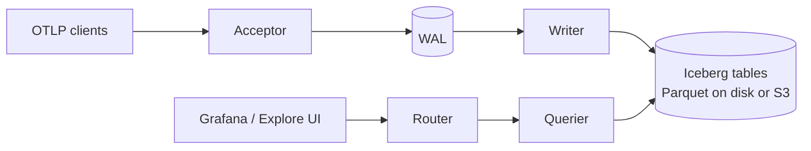

# SignalDB

SignalDB is an observability database for traces, logs, metrics, and
profiles. It ingests OpenTelemetry natively, serves Grafana-compatible
query APIs (Tempo, Loki, Prometheus, Pyroscope), and ships its own
built-in Explore UI — all from a single binary with a single data
directory.

It is built to be **easy to run in a homelab** — one process, SQLite,
local disk, bounded retention — with the **option to scale out** into
separate services backed by PostgreSQL and S3 when you need it.

## Where to start

- **Send data** — point an OpenTelemetry SDK or Collector at SignalDB:
  [Sending OTLP data](users/sending-otlp.md)
- **Explore it** — the built-in UI for logs, traces, and metrics:
  [Explore UI](users/explore-ui.md)
- **Clients retry throttling for you** — the SDK, CLI, MCP server, and UI
  back off on `429` the same way:
  [Client retry](users/client-retry.md)
- **Use Grafana** — connect via the Tempo/Loki/Prometheus-compatible
  APIs or the native plugin: [Grafana datasource](users/grafana-datasource.md)
- **Run it** — deployment, storage, WAL durability, retention:
  [Operating SignalDB](operations/wal-persistence.md)

## The short version

In monolithic mode all of these run inside one `signaldb` process. In
microservices mode each box is its own binary — same code, same
storage format. See the [architecture overview](architecture/overview.md)
for how the pieces fit together.

## Project status

SignalDB is under active development. Trace storage and the Tempo-compatible API
are the most mature surface; LogQL and PromQL support cover most of
each language with remaining gaps tracked on
[GitHub](https://github.com/cedricziel/signaldb/issues). Interfaces
and storage layout may still change between releases.
