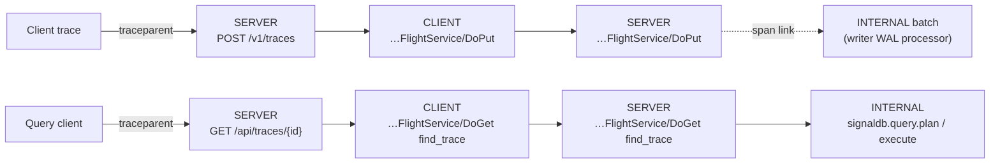

# Self-Monitoring Trace Model

The spans SignalDB emits about its own operation follow the OpenTelemetry
semantic conventions, pinned at **semconv v1.43.0** (the `schema_url` on
every exported resource). The instrumentation scopes carry SignalDB's own
registry URL, `https://cedricziel.github.io/signaldb/schemas/<version>`, where `<version>` is
the SignalDB release that emitted the telemetry: `otel/registry/manifest.yaml`
defines the `signaldb.*` attributes on top of that semconv pin, release-please
bumps its version with each release, and the build script hands it to the
code as `SIGNALDB_SCHEMA_URL`. This page is the
operator-facing reference: what spans exist, what they're named, and what
changed if you had dashboards on the old names.

This page covers spans only. Counter/histogram/gauge instruments (e.g.
`signaldb.wal.entries_written`, `signaldb.wal.corrupt_entries` with its
`record=log|data` attribute, `signaldb.wal.instances`,
`signaldb.wal.instance_cap_hits` with its `outcome=evicted|over_cap`
attribute, `signaldb.wal.list_failures`) are defined
in `src/common/src/self_monitoring/app_metrics.rs`; WAL-specific ones are
documented alongside their recovery behavior in
[WAL Persistence](wal-persistence.md#monitoring-and-alerting).

The registry is no longer spans-only, though: the compactor's job counters
(`compactor.jobs.started`/`.succeeded`/`.failed`, scraped as
`compactor_jobs_*_total`) are declared there as `type: metric` groups, so
their names and label sets are governed the same way. Those are rendered by
hand on the compactor's own Prometheus endpoint rather than through the OTel
SDK, and a test in the compactor fails the build if the two disagree — see
[Compactor Operations](compactor/operations.md#compaction-retries).

Two writer instruments are worth naming here because they are read together:
`signaldb.writer.commit_duration` (histogram, `tenant` attribute) is how long
one group's Iceberg commit took, and `signaldb.writer.groups_deferred` (gauge)
is how many groups the commit-coalescing floor held back on the last cycle.
Groups commit concurrently, so one tenant's slow commits appear as that
tenant's latency rather than as everyone's — a p99 that rises for a single
`tenant` value is that tenant's catalog or object store, while one that rises
across all of them is shared infrastructure. A sustained non-zero
`groups_deferred` alongside rising `signaldb.wal.entries_pending` means commits
are not keeping up regardless of which.

A third, related gauge: `signaldb.writer.entries_deferred_by_budget` counts WAL
entries a WAL's backlog held past `[writer].max_drain_bytes_per_cycle` on the
last drain cycle — left durable and unprocessed, retried on a later cycle
rather than decoded to Arrow all at once. Distinct from `groups_deferred` (the
commit-coalescing floor holding back _decoded_ groups): this one is entries the
cycle never even decoded. Expect brief non-zero spikes right after a restart
that recovers a large backlog; sustained non-zero means the backlog is larger
than the budget drains per tick.

A fourth: `signaldb.writer.commit_failures` (counter, `signaldb.tenant.id` and
`kind` attributes) counts group commit attempts that did not land, split into
`permanent` (a routing/schema fault or an unknown target table — the batch
itself will never commit) and `transient` (a catalog/object-store/WAL-index
outage, expected to clear on its own). Only `permanent` failures count toward
an entry's dead-lettering budget; a sustained `transient` rate with no drop in
`signaldb.wal.entries_pending` means a dependency is down, not that data is
being lost — the affected entries stay pending and retry once it recovers.

## Resource identity

Every service exports with:

| Attribute                     | Value                                                                                                                                  |
| ----------------------------- | -------------------------------------------------------------------------------------------------------------------------------------- |
| `service.namespace`           | `signaldb`                                                                                                                             |
| `service.name`                | `signaldb-acceptor`, `signaldb-router`, `signaldb-writer`, `signaldb-querier`, `signaldb-compactor` (or `signaldb` in monolithic mode) |
| `service.version`             | crate version                                                                                                                          |
| `service.instance.id`         | per-process UUID                                                                                                                       |
| `deployment.environment.name` | `[self_monitoring] environment` config key (default `production`)                                                                      |

The deprecated `deployment.environment` attribute is no longer emitted.

## Span model

- **HTTP boundaries** (router APIs, acceptor OTLP/HTTP + remote-write,
  health): SERVER spans named `{method} {route}` with the stable `http.*`
  attributes. 4xx leaves span status unset (caller fault); 5xx sets Error +
  `error.type`.
- **gRPC/Flight boundaries**: SERVER and CLIENT spans named by the
  fully-qualified method plus a low-cardinality detail
  (`arrow.flight.protocol.FlightService/DoGet query_ir`,
  `…/DoAction compact_dry_run`, OTLP
  `opentelemetry.proto.collector.trace.v1.TraceService/Export`), carrying
  `rpc.system.name=grpc`, `rpc.method`, string `rpc.response.status_code`.
  Server spans fail only on server-fault codes; client spans on any non-OK.
  CLIENT spans also carry `server.address`/`server.port` (the resolved
  target, from service discovery); SERVER spans carry
  `network.peer.address`/`network.peer.port` (the connecting socket, from
  `tonic::Request::remote_addr()`) when available.
- **SQL catalog**: CLIENT spans `{verb} signaldb-catalog` with
  `db.system.name` / `db.operation.name` / `db.namespace` /
  `db.query.text` (literal-sanitized, same `?`-placeholder convention as
  the query stages below — sqlx binds values rather than interpolating
  them, so there's normally nothing to strip).
- **Query stages**: `signaldb.query.plan` / `signaldb.query.execute`
  INTERNAL spans with `signaldb.query.rows`/`batches`; recorded query text
  is always literal-sanitized (`… WHERE name = ?`).
- **Background jobs**: `compaction`, `retention_enforcement`,
  `orphan_cleanup` root INTERNAL spans with `signaldb.tenant.id` /
  `signaldb.dataset.id` / `signaldb.table` and affected-object counts
  (`signaldb.job.partitions_dropped`, `…snapshots_expired`,
  `…files_deleted`, `…bytes_reclaimed`).

  Orphan cleanup carries enough to reconstruct a pass without reading the
  source: why it declined a table (`signaldb.job.skip_reason`,
  `…estimated_live_files` against `…live_files_threshold`), what it saw
  (`…live_files`, `…total_files`, `…scanned_metadata_files`,
  `…candidates`, `…grace_period_hours`), and what it did
  (`…files_deleted`, `…bytes_reclaimed`, `…deletion_failures`,
  `…dry_run`). Counts are emitted as `i64` — the registry types them as
  `int`, and `usize`/`u64` would otherwise bridge to OpenTelemetry as
  strings and break numeric queries. Per-file deletion detail stays in
  plain logs: a path per file is unbounded cardinality and does not belong
  in span attributes.

- **WAL fan-in**: the writer's batch span **links** to every distinct
  source ingest trace (one link per origin, never a parent).
- **MCP tool calls** (the `signaldb-mcp` sidecar, when its
  `[self_monitoring]` is enabled): every `tools/call` runs in one INTERNAL
  span named `tools/call {tool}` (`mcp.method.name=tools/call`,
  `gen_ai.tool.name`, `mcp.session.id`, `signaldb.tenant.id`,
  `signaldb.dataset.id`), parented to the client's `traceparent` when the
  HTTP request carried one. Status is Error + `error.type` only for a
  failed call — a router `4xx` (denied) or throttled outcome leaves it
  unset. Arguments and results are never recorded. The MCP HTTP requests
  themselves are `POST /mcp` SERVER spans like every other HTTP boundary.
  The pinned semconv snapshot keeps the MCP and GenAI attribute names only
  as deprecated shells (moved to the GenAI conventions repository);
  `otel/registry/` references `mcp.session.id` and declares the
  `signaldb.mcp.outcome` label, and the factory pins all names to the
  semconv crate. Alongside the span, each call emits one audit event
  (`signaldb_mcp::audit`: `tool`, `tenant_id`, `dataset`, `session_id`,
  `outcome`, `duration_ms`, `error.type`) and records the
  `signaldb.mcp.tool_calls` counter (by `gen_ai.tool.name` and
  `signaldb.mcp.outcome`: `ok | truncated | denied | throttled | error`)
  and the `signaldb.mcp.tool_call.duration` histogram (seconds, by tool) —
  Prometheus `signaldb_mcp_tool_calls_total` /
  `signaldb_mcp_tool_call_duration_seconds`. See
  [MCP server](../users/mcp.md#audit-and-observability).

Trace continuity: a caller-supplied W3C `traceparent` is honored at every
boundary, and the sampler is parent-based by default (an unrecognized
`OTEL_TRACES_SAMPLER` value also falls back to parent-based).

The HTTP middleware also returns the server span's context to the caller on
every response (`Server-Timing: traceparent;desc="..."` + `traceresponse`,
plus `dur` stage timings), with the trace flags reflecting the sampling
decision. Headers are omitted when self-monitoring is disabled and on
`_system` tenant requests. Caller-facing reference:
[Trace Context on HTTP Responses](../users/response-trace-context.md).

## Renames (breaking for dashboards)

| Old                                                       | New                                                   |
| --------------------------------------------------------- | ----------------------------------------------------- |
| span `flight_do_get`                                      | `arrow.flight.protocol.FlightService/DoGet <verb>`    |
| span `flight_do_put`                                      | `arrow.flight.protocol.FlightService/DoPut`           |
| span `compaction_job`                                     | `compaction`                                          |
| field `tenant_id`                                         | `signaldb.tenant.id`                                  |
| field `dataset_id`                                        | `signaldb.dataset.id`                                 |
| field `table` / `table_name`                              | `signaldb.table`                                      |
| field `entry_count`                                       | `signaldb.wal.entry_count`                            |
| field `operation` / `data_size` / `entry_id` (WAL spans)  | `signaldb.wal.operation` / `…data_size` / `…entry_id` |
| resource `deployment.environment` (= `"self-monitoring"`) | `deployment.environment.name` (config-sourced)        |

## Conventions registry and enforcement

The `signaldb.*` attributes are declared in `otel/registry/` (an OTel
Weaver registry layered on upstream semconv v1.43.0). CI validates the
registry (`weaver registry check`), pins code↔registry drift
(`registry_pins` test), enforces span-construction rules (no bare
`#[tracing::instrument]`; `otel.kind` only in the span factories), and an
advisory **Weaver Live Check** workflow boots the monolithic binary
against a `weaver registry live-check` listener and reports findings plus
`registry_coverage` per PR (hardening to a blocking check is tracked in
#912; further follow-ups: #913, #914, #915, #916).

Spans carry only registry-declared attributes. The tracing→OTel bridge's
convenience attributes (`busy_ns`, `idle_ns`, `target`, `code.*`) are
disabled at construction (`common::self_monitoring::otel_span_layer`,
pinned by the `otel_bridge_attrs` test) — don't build dashboards on them.

Three bridge-emitted attribute families cannot be disabled and are instead
whitelisted for live-check via finding filters in the repo-root
`.weaver.toml`: `thread.id`/`thread.name` on spans (upstream semconv at
`development` stability — kept deliberately), `level`/`target` on span
events (stamped unconditionally by tracing-opentelemetry's event bridge),
and the `not_stable` advice for our own `signaldb.*` attributes (the
SignalDB registry is `development` by design). `info!`/`warn!` events
inside instrumented spans become span events, so their fields must be
declared in the resolved registry — `signaldb.*` for SignalDB-specific
fields, or an upstream semconv attribute (e.g. `file.path`) where one
fits. Per-item developer detail belongs at `debug!`, which the default
`info` level keeps out of telemetry.
