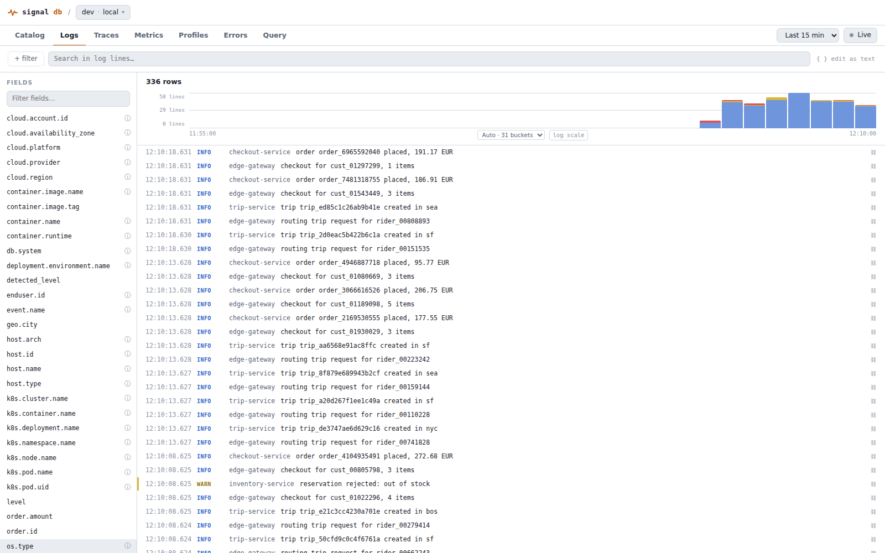
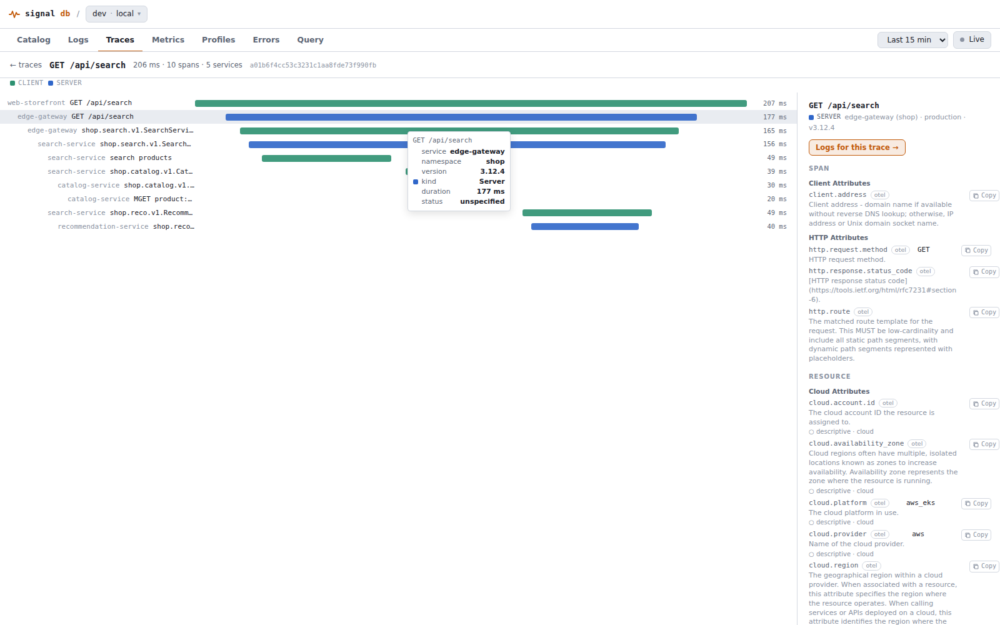
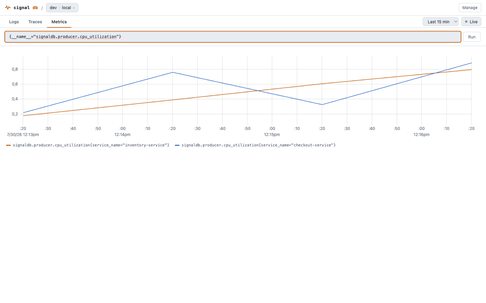
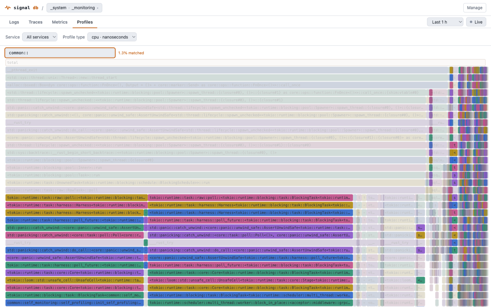
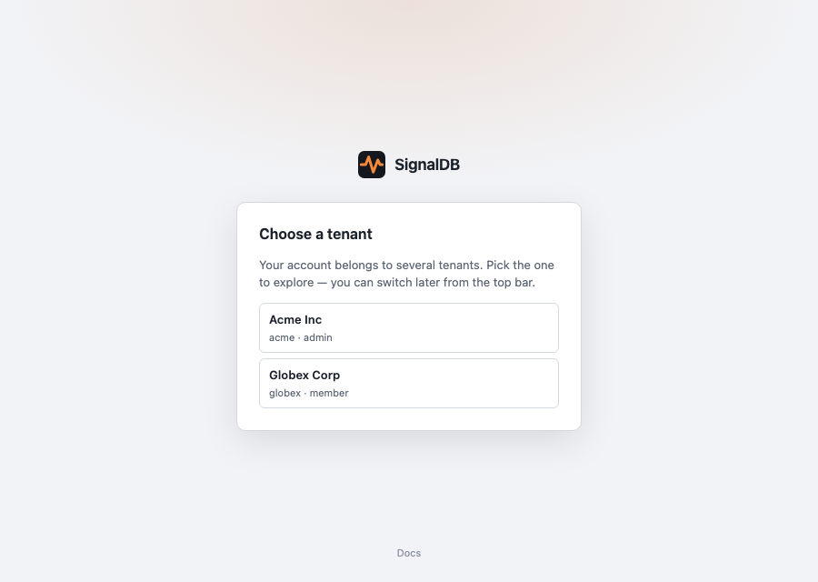

# Explore UI

SignalDB ships a built-in explore UI for logs, traces, and metrics, served
by the router at its **root** (`http://<router>:3000/`, as a SPA fallback
behind the API routes). It consumes the same Loki-, Tempo-, and
Prometheus-compatible APIs that Grafana uses, so anything visible in the UI is
equally queryable from Grafana. It also hosts the OAuth connector **consent
screen** at `/oauth/consent` (see [MCP](mcp.md)).



## What it does

- **Catalog** — a service/infrastructure catalog discovered by querying the
  ingested telemetry for OTel semantic-convention resource attributes, not
  from a fixed inventory. See [The catalog](#the-catalog).
- **Logs** — filter chips compiled to LogQL (with an "edit as text" escape
  hatch), a per-level volume histogram, a virtualized log list with
  per-attribute filter/exclude actions, a fields sidebar, and live tail.
- **Traces** — a facet sidebar and a span-volume chart stacked by span status
  sit above a group-first view: recent traces arrive grouped by root
  span name (or by service, any observed root-span/resource attribute, or
  two dimensions combined via "Then by"), with per-group trace count,
  request rate, error rate, p50/p95 latency, and last-seen columns —
  all sortable. An **Errors only** checkbox at the top of the facet sidebar
  narrows groups, list, volume chart, and facet counts to traces whose root
  span has an error status (it is the `status = Error` facet filter as a
  one-click toggle). The **span.kind** facet always lists all five kinds as
  checkboxes with their counts, several can be on at once (one `in` filter),
  and Server, Client, Producer, and Consumer are selected by default —
  Internal spans are opted into; unchecking the last kind selects them all.
  Root spans are what the default **Traces** grain already inspects. Facets
  with a selection sit at the top of the sidebar and start expanded (collapse
  them by hand); the rest follow, collapsed, in their curated order. Selecting a group lists just its traces — each with its
  status as a coloured chip (error / ok / unset), sortable with errors
  first; selecting a trace
  opens a waterfall with span details and error highlighting. A parent span
  that recorded no duration (an un-ended root, for instance) is drawn as a
  dashed outline over its child spans instead of a sliver; its own duration
  still reads as recorded. Hovering a
  span in the waterfall shows a tooltip with the span name, its service,
  namespace, and version, its kind (coloured like the bar), duration, and
  status, without changing the selection. The span
  panel lists that span's events, giving exceptions an error treatment that
  surfaces the message, type, and stacktrace, followed by its attributes —
  split into **Span**, **Scope**, and **Resource** sections (a section with
  nothing in it is omitted) and sorted alphabetically,
  with the sub-header compiling service name, namespace, deployment
  environment, and version from the resource attributes that carry them. A
  value over ~200 characters (a Rust `Debug` dump, a stack trace) collapses
  behind a "More" toggle rather than flooding the panel; the copy button
  always copies the untruncated value. Open-by-ID works from any level.
- **Metrics** — a visual query builder (metric picker, tag filters,
  aggregation, and range functions, all populated from label metadata) with
  multi-query formulas for ratios, plus a "PromQL" tab as the raw escape
  hatch. See [Building metric queries](#building-metric-queries).
- **Profiles** — a flame graph of stored profiles, filtered by service,
  profile type, and (optionally) any discovered attribute. Click a frame to
  zoom into its subtree; a breadcrumb (`root › ... › frame`) tracks the path
  and lets you step back out one level at a time, not just all the way to
  root. Type in the highlight box to light up matching frames — e.g. a crate
  prefix like `common::` — while everything else dims, with a matched-share
  readout for finding your code in a library-heavy profile. A **Compare**
  toggle renders a baseline window (its own time-range picker) alongside the
  current range as two independent, independently-zoomable flame graphs, for
  spotting what changed. A **Collapse** selector folds below-threshold
  frames into a muted `(other)` bucket to cut visual noise, and a
  **Top functions** view swaps the tree for a sortable flat table ranked by
  self time. See [Comparing and filtering profiles](#comparing-and-filtering-profiles)
  and [Reading a noisy profile](#reading-a-noisy-profile).
- **Errors** — exceptions grouped by type, message, service, and whether
  they were handled, sortable by count (default) or by last-seen recency.
  Combines the two places OTel records an exception — a span's `exception`
  event, and a log record's own `exception.type`/`.message` attributes (see
  [Exception attributes](querying-ir.md#exception-attributes)) — since
  neither source alone is the whole picture. A facet sidebar (type, service,
  source, handled) narrows the list. Selecting a group shows a
  count-over-time chart for that exact group plus its individual
  occurrences (up to 25, newest first); each occurrence independently offers
  a link into the trace waterfall when it carries a trace id — occurrences
  of the same group don't all share one trace outcome — and expands to its
  own stacktrace, rendered with the caller's own frames legible against
  dimmed dependency noise.
- **Query** — a native [Query IR](querying-ir.md) builder for `logs`, `traces`,
  and profile summaries:
  pick a source and result envelope, add filter chips, and the tab emits a
  structured, versioned IR document (no dialect string) via the generated API
  client, rendering the declared `rows`/`series`/`table` result. Any warnings
  the response carries are shown above the result — a group-by field nothing in
  the window carries names itself there, with the closest real field as a
  suggestion, instead of silently rendering one `null`-labelled group.
- **Correlation** — log rows with a `trace_id` open the trace waterfall;
  the span panel links back to logs filtered by that trace, and, for a span
  with a linked profile, offers a "Profile: `<sample type>` →" button that
  opens that exact profile's flame graph.
- Every view is a URL: each signal has its own path (`/catalog`, `/logs`,
  `/traces`, `/metrics`, `/profiles`, `/query`), with time range, filters, and
  selection in query parameters alongside it — so views are separately
  navigable and can be bookmarked, shared, and revisited with the browser
  back/forward buttons. The tenant/dataset context rides along as
  `?tenant=&dataset=`; links that omit it (the user menu, deep links inside
  the schema hub) keep the last context you were in, and the last context is
  also remembered in the browser (cleared on sign-out) so a bookmark or a new
  tab opening a bare `/schema/storage`, `/api-keys`, or `/manage` resumes
  there instead of turning into a tenant-less request. Tenant/dataset
  administration lives at `/manage`.

### The catalog

The catalog answers "what's actually sending telemetry" by discovery, not
configuration. The entity types it can find come from your
[schema registries](schema-registry.md), not from a list baked into
SignalDB: every entity an OTel registry declares — services, hosts,
containers, processes, Kubernetes objects, CI/CD pipelines, service
instances, telemetry SDKs — is catalogable, and a tenant that publishes its
own registry gets its own entity types on the same terms, with no code
change and no configuration.

The nav lists the entity types your telemetry actually carries, not all of
them. SignalDB works out which those are from the field metadata each signal
maintains — one lookup per signal, reading no signal data — and an entity
type appears once some signal carries the attribute that identifies it. So
the nav grows when a new SDK resource detector, an OTel Collector with
`resourcedetection`, or Kubernetes downward-API injection starts populating
an attribute, and it does not fill up with dozens of entity types you have
no data for.

What identifies an entity is resolved against your data too, not taken on
faith from the registry. An entity type is keyed by the identifying
attributes your telemetry actually carries — an attribute the registry
declares but nothing sends is dropped rather than lumping every instance
under one blank value. Where a registry declares no identifying attribute at
all (OTel 1.43 has 26 such entity types, `host` and `container` among them,
whose names are merely _descriptive_), the first descriptive attribute your
data carries stands in. That is what lets those entity types be catalogued
without SignalDB hard-coding a key for each one.

That metadata is maintained by compaction, so a freshly-ingesting deployment
may not have been analyzed yet. The catalog says so — "not analyzed yet"
alongside the age of the metadata it used — rather than showing an empty nav,
which would read as "you have no entities" when the truth is "we have not
looked yet".

An entity type whose attribute is present but has no values in the selected
window renders an explicit empty state naming the attribute and the signals
it looked in, rather than a placeholder row. Where SignalDB knows the
attribute has values outside your window, it says so — "3 values have been
seen outside it (as of …), such as `ix-signaldb-mcp-1`. Try a wider time
range" — which separates "nothing here right now" from "nothing has ever
reported this", two findings that call for opposite next steps. That comes
from the same maintained statistics as everything else on this page, so it
describes what compaction last saw rather than your selected range; it can
tell you values exist, never that they are current. When no statistics cover
the attribute, the empty state stays quiet instead of claiming nothing has
ever been seen.

Catalog selection is part of the URL path: `/catalog/<entity>` lists an
entity type (`service`, `database`, `messaging_destination`, `host`,
`k8s_pod`, …), `/catalog/<entity>/<identity>` opens one entity's detail
page, and `/catalog/<entity>/<identity>/<row>` a breakdown row drilled into
within it. `<identity>` is the entity's identity values, percent-encoded and
comma-joined (`/catalog/service/checkout,shop` for `service.name=checkout`,
`service.namespace=shop`), so entity pages are bookmarkable and shareable
like every other view; tenant, dataset, and time range stay in the query
string. `<entity>` names any entity type the tenant carries, registry-derived
ones included (`/catalog/process_executable/...`) — a link naming one this
tenant has no entity type for says so rather than opening some other type's
page under that name.

An entity keyed by a _resource_ attribute (service, host, Kubernetes
pod/node, container, process — anything an SDK's `Resource` carries, not
just spans) is discovered from **every** signal, and its Last-seen column is
the merge of them: a process that only ever emits metrics, never traced and
never logged, still shows up. This matters more than it sounds — `process.pid`
and `container.name` typically ride on metrics and on nothing else, so
processes and containers are invisible to a trace-only catalog even though
their data is already stored. Each entity type is queried only against the
signals that carry its identity, so nothing pays for a signal that cannot
match.

An entity keyed by a _span_ attribute (database, message destination —
these describe one client call, not the process that made it) is discovered
from traces only.

The list answers "which entities are there", so it carries no sample
counts — how many spans or log lines back an entity is a fact about
SignalDB's storage, not about the thing being observed, and volume from
different signals is not comparable anyway (400 spans plus 2,000 log lines
is not "2,400 requests"). Request rate, error rate and P50/P95 latency are
all derived from traces — a log line has no span status or duration to
measure — so an entity no trace ever carried shows "–" in all four rather
than a misleading "0%" and "0ms" that would report an uninstrumented
service as a flawless one. Which signals cover an entity is shown on its
detail page, under **Signals**; that is what tells you whether a missing
latency number means "healthy" or "not instrumented for tracing".

The subtitle under each entity type's heading ("discovered from ... across
traces, logs") names exactly which attributes and signals fed it.

Selecting a row opens that entity's own page: a breadcrumb, its RED numbers
pinned to exactly that entity, a breakdown table for entity types that have
one (services by operation, databases by `db.operation.name`, infrastructure
entity types by which services were observed alongside them), and a list of
real recent matching spans linking straight into their trace waterfalls. A
breakdown row drills one level deeper the same way. "View matching traces →"
on the entity page hands off to the Traces tab, pre-filtered — the general
escape hatch when the catalog's own view isn't enough.

"Services" is scoped to server-kind spans specifically: a service's own
resource attributes appear on every span it emits, including calls it makes
to its dependencies, so without that scope its request rate/latency would
mix inbound and outbound traffic.

### Comparing and filtering profiles

Every flame graph the Profiles tab renders — the single view, each side of
a comparison, and a profile opened from a trace span — is fetched through
the native [Query IR](querying-ir.md) `profiles` source, not a separate
profiling-specific query language. The Service and Profile type selectors
compile to `service.name`/`sample.type` filters; the optional Attribute
selector compiles to a filter on whatever profile-level attribute key you
pick (populated from the profiles seen in the current time range) — the
same attribute-container resolution the Query tab uses, so anything visible
there as a filterable field is filterable here too.

**Compare** replaces the single flame graph with two independent ones, a
**Baseline** window (its own time-range picker, defaulting to the last
hour) and the current range as the **Comparison** — each fetched, zoomed,
and searched independently, so you can drill into the same subtree on both
sides to see where time moved. There's no synchronized zoom between the two
panes; it's two ordinary flame graphs side by side, not a merged
diff-coded one.

Opening a profile from a trace span's "Profile: `<sample type>` →" button
renders that one profile's actual payload — matched by its exact stored ID,
not re-aggregated from a service/type/time filter — with a "← profiles"
button back to the normal filtered view.

### Reading a noisy profile

A wide, deep profile — especially a Rust one, where monomorphized generics
and full module paths make individual frame names long — gets hard to read
fast. Two controls, alongside the highlight box, cut through it:

- **Collapse** folds every frame narrower than the chosen threshold (Off,
  0.5%, 1%, 2%, 5% of the root — 0.5% by default) into a single muted,
  dashed `(other)` bar per contiguous run, along with that frame's entire
  subtree (a child can never be wider than its parent, so anything under a
  collapsed frame is noise too). It's computed against the profile's total,
  not the current zoom, so a frame that's negligible at the root doesn't
  reappear artificially large just because you zoomed into its parent.
  Changing the threshold resets any active zoom, since the frame you'd
  zoomed into may no longer exist as its own bar.
- **Top functions** replaces the tree with a flat, sortable table — Function,
  Self, Self %, Total, Total % — aggregating every occurrence of each
  function name (so a recursive function's self time is summed correctly;
  its total isn't, the same caveat `pprof top` has). It's the "what's
  actually expensive" view when the tree shape itself isn't what you need.
  Clicking a row switches back to the flame graph with that function
  highlighted, so you can see where the time is spent structurally.

Bar labels are shortened, too — a Rust name for a monomorphized generic
method (`<Type as Trait>::method::<Args>`) can run to hundreds of
characters, and worse, the default right-edge ellipsis cuts off exactly the
distinguishing part (the generics at the end), leaving unrelated frames
looking identical once truncated. Bars show roughly `Type::method` instead.
This is display-only: hover any frame (or a row in the top-functions table)
for a tooltip with the full, unshortened name plus self/total, and the
detail line and highlight search still operate on the real name.

### Reading a log line

Selecting a log line expands it. Alongside the stream labels it lists the
line's **per-line fields**: the trace context (`trace_id`, `span_id`, with a
link through to the trace) and the log and resource attributes the record
actually carried. Attributes appear per line, so two lines in the same stream
show their own values rather than a shared set.

These have no filter/exclude actions yet. The filter chips compile to a LogQL
stream selector, which is the wrong shape for a field that varies line to line;
filtering on them arrives with the Query IR migration, which builds the
predicate server-side.

One limitation to know about: the Loki wire format carries these as one flat
map, so the three OTel attribute scopes — resource, instrumentation scope, and
the log record — are merged in this view, and instrumentation-scope attributes
are not shown at all. Storage keeps all three separate; see the
[Query IR reference](querying-ir.md) to query them individually today.

### What an attribute key means

Wherever the UI shows an attribute key as a label — the expanded log line, the
span-detail attribute table, the logs field sidebar, the trace facet headers,
and the filter chip's key suggestions — it resolves the key through the
[schema registry](schema-registry.md) for the active tenant and shows what the
key means next to it. A known key keeps its raw spelling (still copyable) and
gains its description, the defining namespace (`otel`, or a custom registry's
name), the entity it identifies or describes, and a `deprecated → <new key>`
marker when the convention renamed it; rows in the detail panels are grouped
under the owning group's title (for example "Kubernetes Attributes"), with keys
no registry knows listed under "Other" exactly as before. Hovering a key, or
the info glyph beside a sidebar entry or facet header, opens the full
definition — type, stability, examples, and every other registry that also
defines the key, so a tenant's own definition never hides the upstream one.

Resolution runs in the background and is cached for the session: rows render
at once with the raw key and pick up the semantics when they arrive, and an
unavailable registry endpoint just leaves the keys bare, with no error in the
panel. Typing in the filter chip's key input merges the registry's prefix
search (each suggestion with its description) with the labels observed in the
current data, so an observed key the registry does not know remains
suggestible — marked "seen", without a description.

### Narrowing traces

The traces tab has a facet sidebar. Expanding a facet lists its values with the
number of matching spans **across the whole selected window** — not just the
traces the list happened to fetch — most frequent first. Selecting a value adds
a filter; filters appear as removable chips and narrow the trace list, the group
table, and the volume chart together, so the chart always describes what the
table shows. Filters live in the URL, so a narrowed view is shareable.

Facets currently cover `service.name`, `span.name`, `status`, and `span.kind`,
plus a curated set of common resource/span identity attributes (`host.name`,
the `k8s.*` fields, `db.namespace`, …) — a defined TraceQL selector and
quoting rule per field, not an enumeration limit; a facet for another
attribute is a UI addition, not a backend one. To slice by any other
attribute today, use the "Group by attribute" custom dimension field below
the group table: it now suggests the attribute keys actually observed in
the current window (merged with schema-registry hits), backed by the same
tag-discovery API that also powers `/api/search/tags` and the MCP/CLI
`discover` surfaces ([#1073](https://github.com/cedricziel/signaldb/issues/1073)).

Both the facet sidebar and the traces' span-detail panel are resizable: drag
the handle on the sidebar's trailing edge. The facet/field sidebar's width is
shared between the logs and traces tabs and persists across sessions.

### The group table

Traces are presented grouped, one row per distinct value of the grouping
dimensions, carrying **RED** for that group: request count, rate over the
window, error count, and p50/p95 duration, plus when the group was last seen.

Every one of those numbers is a server-side aggregate over the whole selected
window. The row budget (500 groups) bounds how many _groups_ come back, never
the records they are computed from — so a group's p95 is the p95 of all its
records in the window, and changing the row limit does not move it. When more
than 500 groups exist the table says so; it does not claim a total, because the
number of distinct groups is not something the query returns.

**Grain** selects what a row counts:

| Grain    | A row counts        | Duration is          | Filters match          |
| -------- | ------------------- | -------------------- | ---------------------- |
| `traces` | traces (root spans) | the trace end-to-end | the **root** span only |
| `spans`  | matching spans      | each span            | any span               |

Trace grain is the default. Because it scopes the query to root spans, a filter
on a field that only ever appears on a child span — a `db.system` on an inner
call, say — legitimately matches nothing and the table is empty; switch to span
grain to see those matches. Matching a trace because _any_ of its spans matches,
while still grouping by the root, is a structural query and is not available
yet. The grain lives in the URL, so a shared link reproduces it.

**Grouping** is by span name and optionally a second dimension. Beyond the
built-ins (`span.name`, `service.name`) you can type any attribute name —
`http.route`, `deployment.environment` — and the server groups by it directly,
including a bucket for records carrying no value for it.

**Sorting** re-runs the query rather than reordering the rows on screen. This
matters: the table holds the top 500 groups _under the current sort_, so
reordering those locally would answer "the slowest of the 500 most frequent
groups" instead of "the 500 slowest". Sorting by rate is the same ordering as
sorting by count, since rate is count divided by a fixed window.

### Reading the volume charts

The logs and traces tabs both open with a stacked volume chart — logs by
severity level, traces by span status (span rows, not distinct traces).

Both charts are server-side aggregates over the whole selected window. They are
**not** derived from the rows in the list below them, so the row limit never
truncates them: a chart that looks flat is reporting flat data, not a truncated
query.

Point at any bucket — anywhere in its column, however short the bar — for its
timestamp, a per-series breakdown, and the bucket total. Buckets are also
focusable, so the same detail is reachable with the keyboard.

### Chart tooltips

Every chart in the UI reads back the exact data under the pointer through the
same tooltip: the metrics chart lists every series at the pointed timestamp
with its colour swatch and value (a dash where a series has a gap); the trace
volume area chart and the logs histogram show the bucket's time range,
per-series values, and total; the latency heatmap shows a cell's time bucket,
latency range, span count, and share of its column; the error sparkline shows a
bucket's occurrences; the catalog's dependency bar shows a category's time,
share, and call count; and the flame graph names a frame with its self/total
time. The tooltip follows the pointer, flips to stay inside the panel, and
never gets in the way of the data. Bars, cells, and segments are keyboard
focusable and announce the same content to assistive technology; the metrics
chart, drawn on a canvas, is pointer-only. Pointing at an empty region shows
nothing.

Two controls sit beside the time axis. **Bucket width** sets the chart's
resolution — it defaults to a width chosen for the selected window, and each
offer states how many buckets it produces, so "finer" and "coarser" are
concrete. A width chosen for a narrow window is not carried over to a much
wider one, which would otherwise issue a needlessly expensive query.

One busy bucket can dwarf the rest of the window: at a 36:1 ratio the typical
bucket occupies about 5% of the chart's height. The **log scale** toggle beside
the time axis compresses the vertical range so the baseline stays readable next
to a spike. It applies to the bucket total, with each stacked series keeping its
true proportion of the bar. Both controls travel in the URL — a shared link
opens on the same resolution and scale the sender was using.

A series that is present in a bucket is always drawn, however small its share:
a handful of errors among tens of thousands of other spans stays visible as a
thin band rather than rounding away.







## Building metric queries

The metrics view opens on a **visual builder** so you don't have to hand-write
PromQL. A query row reads left to right as a sentence:

```
[ a ]  metric ▾   from ⟨ filters ⟩   avg by ⟨ group ⟩   function ▾
```

- **Metric** — type or pick a metric name; suggestions come from the
  Prometheus `__name__` label for the current time range.
- **from** — add tag filters (`+ filter`). Label names and their values are
  suggested from the metadata endpoints, so you filter on what exists rather
  than guessing. Each filter has an operator (`=`, `!=`, `=~`, `!~`).
- **aggregation** — choose a space aggregation (`sum`/`avg`/`min`/`max`/
  `count`) and an optional comma-separated **group by** to get one series per
  tag value.
- **function** — an optional range function (`rate`, `irate`, `increase`, or
  an `*_over_time` rollup) with a lookback window (default `5m`).

Labels are annotated with their approximate value count (from
[`/label_stats`](querying-promql.md#label-cardinality)), and grouping by a
high-cardinality label — one that would explode into thousands of series, like
a pod or trace id — shows a `⚠` warning before you run it.

A live preview shows the compiled PromQL beneath the row; **Run** charts it.
For a single query row with no range function and no formula, Run queries the
[Query IR](querying-ir.md) `metrics` source instead of PromQL — same builder,
same preview, no visible difference, except a dotted OTel-native metric name
(e.g. `signaldb.wal.entries_processed`) now works, where PromQL's grammar
can't lex it. Adding a second query row (even without a formula), a range
function, or a formula all fall back to PromQL, unchanged.

### Formulas across multiple queries

Add more rows with **+ query** — each gets a letter (`a`, `b`, …) — and combine
them in the **formula** box. Single letters are substituted with each query's
compiled expression, so a ratio like an error rate is:

```
formula:  (a / b) * 100
```

with `a` = `sum(rate(http_server_errors[1m]))` and `b` =
`sum(rate(http_server_requests[1m]))`. PromQL function names are left
untouched. With no formula, the first row is charted on its own.

### Editing the raw PromQL

The **PromQL** tab is the escape hatch for anything the builder doesn't cover.
Switching to it seeds the box with the query the builder compiled, so you can
start visually and finish by hand. (Editing raw PromQL back into the builder
is not supported yet.) The same PromQL runs unchanged in Grafana or against
the [`/prometheus/api/v1` endpoints](querying-promql.md). Unlike the builder's
default path, this tab always uses PromQL — a dotted OTel-native metric name
typed here directly will still 400, same as any other PromQL client.

## Signing in

On an embedded deployment (the UI served by the router at `/ui`), the
first query that fails as unauthenticated opens a sign-in form asking only
for a user email and password. Accounts that belong to a single tenant land
directly in it (on its default dataset); accounts spanning several tenants
pick one from a selector listing each membership by name and role. See
[the authentication reference](authentication.md).



Signing in calls `POST /ui/session`, which validates the credentials and
sets an `HttpOnly`, `Secure`, `SameSite=Strict` cookie containing an opaque
random token. The password and tenant API keys never live in the cookie,
page JavaScript, `localStorage`, or URLs. Sessions expire after 12 hours;
`DELETE /ui/session` revokes the server-side session and clears the cookie.

Once signed in, the tenant/dataset selector offers the user's tenant
memberships and the selected tenant's datasets. The chosen values are sent
as `X-Tenant-ID`/`X-Dataset-ID`; the server validates the tenant against the
current user's memberships. Switching tenant or dataset only changes the
context — you stay on the page you are on (a signal view, the Schema hub,
`/api-keys`, …); it never routes you elsewhere.

In development the Vite proxy injects credentials from `.env.local`
instead, so no sign-in is needed.

## User menu

Once signed in, a user menu appears in the top bar showing an avatar
(initials from the display name), the user's name, and a dropdown with:

- **Appearance** — toggle between light and dark theme; the choice is
  persisted in `localStorage` and restored on reload.
- **Send data** — opens the Instrumentation page (see below).
- **API keys** — opens the API Keys page (see below).
- **Schema** — opens the Schema hub (see below).
- **Docs** — opens the SignalDB documentation in a new tab.
- **Switch tenant** — opens the Tenant Selection page (see below).
- **Sign out** — deletes the session, clears the query cache, and
  reloads the page.

The menu closes on Escape or backdrop click.

### Management panel (`/manage`)

Tenant-admin-only. A deep-linkable panel (not ad hoc component state, so it
survives a bookmark or browser back/forward) covering the tenant's
self-service surface in one place: **Datasets** (create, delete non-default
ones), **API keys** (create with a scope picker, revoke; the secret shows
once), **Members** (add or update a role by email, remove), **Tables**
(the tenant's provisioned signal tables, grouped by dataset with one heading
per dataset, refetched immediately after provisioning; a **Provision tables**
action calls the manual-trigger endpoint — see
[table provisioning](../operations/table-provisioning.md)), and, for
instance administrators only, **New tenant**. All of it consumes the
generated client (`src/ui/src/api/management.ts`), never raw `fetch`.

### Tenant selection (`/select-tenant`)

Shows every tenant the user is a member of, with their role on each.
The current tenant is expanded by default to reveal its datasets;
clicking a dataset navigates to `/logs` with that tenant/dataset
selected. Other tenants are collapsed and fetch their datasets lazily
via `whoami(tenant_id)` on expansion.

### API keys (`/api-keys`)

Tenant-admin-only page for managing API keys. The same API functions
used by the admin management panel (`listApiKeys`, `createApiKey`,
`updateApiKey`, `revokeApiKey`) power this page, but it is scoped to
the current tenant rather than requiring instance-admin privileges.

Every key carries explicit scopes chosen in a picker grouped into
**Ingestion** (`metrics:write`, `logs:write`, `traces:write`,
`profiles:write`), **Schema** (`schema:read`, `schema:write`), and
**Management** (`tenant:manage` — lets the key manage this tenant's
datasets, keys, and members through the same management API this page
uses; see [Authentication](authentication.md#api-key-scopes)), each with a
one-line description; at least one scope is required, and an optional
dataset restriction can be set. The list shows each key's scopes,
and **Edit scopes** on a live key changes them in place (via
`PATCH /api/v1/manage/tenants/{id}/api-keys/{key_id}`) without rotating
the secret; the change applies to the key's next request.

Creating a key shows the secret once in a modal with a copy button;
revoking is immediate and irreversible, and revoked keys cannot be edited.

### Instrumentation (`/instrumentation`)

Guided, source-specific instructions for sending telemetry to
SignalDB. A sidebar lets the user pick one of six sources:

| Source         | Snippet type                    |
| -------------- | ------------------------------- |
| OTel SDK       | `OTEL_EXPORTER_OTLP_*` env vars |
| OTel Collector | YAML exporter config            |
| Kubernetes     | Helm values / kubectl manifest  |
| Docker         | `docker run` / compose env vars |
| journald       | Promtail config                 |
| Prometheus     | `remote_write` config           |

Every snippet is interpolated with the user's actual tenant ID and
dataset ID from `whoami`, so they can be copied directly. A
verification section at the bottom shows ingestion status per signal
(metrics, logs, traces, profiles) — currently static ("Waiting for
data"), with real checks planned.

### Schema hub (`/schema`)

Two tabs, each a real URL so the browser back button walks between
views:

- **Conventions** (`/schema/conventions`, every tenant user) — the
  semantic-convention registries visible to the tenant: the bundled
  `otel` and `signaldb` registries (read-only, marked with a lock) plus
  any custom registries, with version, source, definition counts, and
  last update. A precedence line shows the order lookups use (custom
  first). The lookup box resolves an attribute key, entity name, or
  metric name across all registries and lists every hit in precedence
  order, the first marked primary. Opening a registry
  (`/schema/conventions/<namespace>/<version>`) shows a browser with a
  filter box over its attributes, entities, and metrics and a definition
  pane; each definition has its own URL
  (`…/attributes/<key>`, `…/entities/<name>`, `…/metrics/<name>`) and
  links to alternatives defined in other registries.
- **Storage** (`/schema/storage`, instance admins only) — the logical
  (query-facing) field model and the resolved physical storage schema
  per signal source, as before.

Tenant admins also get **New** / **Upload registry** on the Conventions
tab and **Edit** on custom registries: a source editor over the
Weaver-format YAML or JSON document with server-side **Validate**
(per-path errors and resulting counts), **Save** / **Replace** (blocked
until validation passes), **Save as new version**, a summary of added,
changed, and removed definitions against the stored document, and
**Delete** with confirmation. Bundled registries never expose these
actions.

## Throttling and retries

Every request the UI makes goes through one retrying `fetch` shared with the
generated API client (see [client retry](client-retry.md)): a `429` from the
tenant's query rate limit is retried after the server-stated `Retry-After`
when the response carries one, or a jittered backoff otherwise (idempotent
transient failures too): retries absorb a brief burst while the bounded
retry budget lasts, so it usually doesn't flash an error. While a retry
is pending the panel keeps loading and a thin banner under the
top bar reads "Some requests are being retried after throttling…"; leaving the
page or superseding the query cancels the wait. Once the retry budget is
spent, the panel's error reads `Rate limited — server asked to retry in N s`
rather than a generic failure.

## Availability

Container images (router and monolithic) ship the UI preinstalled. For
source builds, the router serves the directory named by `SIGNALDB_UI_DIR`:

```bash
pnpm install && pnpm ui:build          # builds src/ui/dist
SIGNALDB_UI_DIR=src/ui/dist cargo run --bin signaldb
```

Without `SIGNALDB_UI_DIR`, the root serves a placeholder page. Setting the
variable to a directory without a built UI fails startup on purpose — a
misconfigured deployment should not silently ship without its UI.

## Telemetry

The UI is instrumented with OpenTelemetry (browser SDK) across two signal
types. **Spans**: it injects a W3C `traceparent` into every API call so a user
action correlates end-to-end with the backend traces it triggers, and stamps
every span with a RUM `session.id` plus the active `tenant.id` / `dataset.id`.
The initial page load is correlated in the reverse direction: the router
injects the server's trace context directly into `index.html` as a
`<meta name="traceparent">` tag, and the UI uses it as the real parent of its
`documentLoad` span (falling back to a same-trace-id _link_, read from the
response's [`Server-Timing: traceparent`](response-trace-context.md) entry,
when no tag is present). See [Trace context in the document
body](response-trace-context.md#trace-context-in-the-document-body) for the
sampling trade-off that comes with real parenting.

**Log records**: Core Web Vitals, navigation/resource timing, route changes,
uncaught errors, and console `error`/`warn` calls are captured as log records
via `@opentelemetry/browser-instrumentation`, stamped with the same
`session.id`/`tenant.id`/`dataset.id`. Browser errors show up here (not as
`browser.error` spans — that hand-rolled span capture was replaced by this).
The UI's resource also carries `service.namespace`, `signaldb.server.version`
(the backend build that served the session — distinct from the UI bundle's
own `service.version`), and `deployment.environment.name`, all sourced from
the same runtime config as the export settings below. Full instrumentation
list and rationale in the `frontend-instrumentation` skill.

Export is **opt-in**. The preferred way to turn it on is the
`[self_monitoring.frontend]` config section — the router serves it to the
browser at runtime, so one image works for every deployment without a rebuild:

```toml
[self_monitoring.frontend]
enabled = true
endpoint = "http://signaldb.example:4318"   # reachable from the browser; both /v1/traces and /v1/logs
api_key = "sk-ingest-only-key"               # world-readable; ingest-only
# tenant_id / dataset_id default to _system / _monitoring
# allowed_origins = ["http://signaldb.example:3000"]  # CORS; empty = any
```

The `api_key` is delivered to the browser and is visible to anyone who can load
the UI, so use an **ingest-only** key and only on a trusted network. When the
UI is internet-facing, point `endpoint` at an OTLP collector that adds
auth/tenant headers and scrubs PII instead of straight at the acceptor. With
export unset, propagation still works and dev builds print spans to the
console. (A build-time `SIGNALDB_OTLP_ENDPOINT` is still honoured as a
fallback.) Contributor detail lives in the `frontend-instrumentation` skill.

## Developing the UI

See [src/ui/README.md](https://github.com/cedricziel/signaldb/blob/main/src/ui/README.md): `pnpm ui:dev` runs a Vite
dev server with hot reload that proxies API calls to any live SignalDB
instance (local or remote) with credentials injected from `.env.local`.

The UI talks to the API only through the generated TypeScript client in
`src/ui/src/api/gen/` (regenerated with `cargo xtask generate` whenever the
OpenAPI document changes); it covers every router endpoint, including the
[schema registry](schema-registry.md) operations the semantic attribute labels
and the Schema hub are built on.
